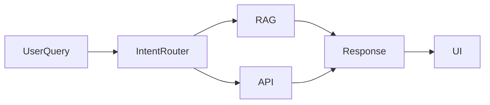

# ADAAS — AI HR Assistant

Hybrid RAG AI assistant integrating LLM reasoning with real-time enterprise APIs.

## Architecture

## Workflow
query → intent routing → RAG or API → structured response

### Highlights
hybrid reasoning architecture, 
API routing logic and 
real-time data integration.

## License
MIT
