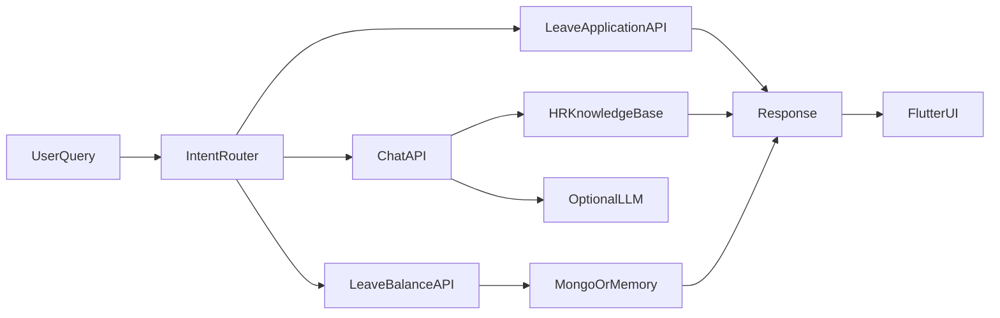

# ADAAS — Artificially Driven Assistant for Automated Solutions

AI Flutter-based HR assistant with a Node/Express backend for leave balance, leave
application, and HR policy chat. The app routes user messages to either HR APIs
or policy Q&A using a shared intent router.

## Architecture



## Backend

Endpoints:

- `GET /health`
- `GET /metrics`
- `GET /leave-balance?employee_id=1001`
- `POST /leave-application`
- `GET /leave-applications`
- `POST /chat`

Set `API_KEY` to require `X-API-Key` on HR data and chat endpoints.

Run:

```bash
cd hr-backend
npm install
npm test
npm start
```

The backend uses MongoDB when `MONGODB_URI` is configured and falls back to
seeded in-memory demo data otherwise. `GEMINI_API_KEY` is optional; without it,
policy chat returns deterministic knowledge-base answers.

Docker:

```bash
cd hr-backend
cp .env.example .env
docker compose up --build
```

Kubernetes manifests live in `hr-backend/k8s/deployment.yaml` and include
readiness/liveness probes, resource limits, and Secret-backed configuration.

## Flutter App

Run:

```bash
flutter test
flutter analyze
flutter run -d chrome \
  --dart-define=HR_API_BASE_URL=http://localhost:3000 \
  --dart-define=HR_API_KEY=change-me
```

## Highlights

- BLoC chat flow.
- Shared intent router for tests and production code.
- Backend-hosted chat generation.
- Configurable API base URL via `HR_API_BASE_URL`.
- Optional frontend API key propagation via `HR_API_KEY`.
- Backend request IDs, metrics, safe error responses, and leave-application persistence.
- GitHub Actions CI for backend tests/container build and Flutter analyze/tests.
- Local RAG fallback for policy answers.
- Unit tests for routing, model parsing, leave logic, RAG retrieval, and widgets.

## License

MIT
