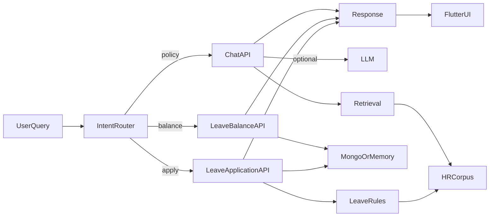

# ADAAS — Artificially Driven Assistant for Automated Solutions

A Flutter HR assistant over a Node/Express backend. Employees check leave
balances, file leave applications, and ask about company policy in plain
language. A rule-based intent router decides which of the three a message is,
then routes it to the HR APIs or to policy retrieval.

Every external dependency is optional. MongoDB is used when `MONGODB_URI` is
configured and seeded in-memory data otherwise. An LLM is used when
`LLM_PROVIDER` is set and policy answers come straight from the retrieved policy
text when it is not. The whole thing runs end to end on a laptop with no cloud
account, no API key and no billing.

## Where this is honest, and where it is weak

The interesting numbers are the bad ones, so they are stated up front rather
than left for a reader to discover.

| What | Measured |
|---|---|
| Policy retrieval, queries taken from the corpus's own `question` fields | top-1 **0.9231** |
| Policy retrieval, the same 26 policies asked in paraphrase | top-1 **0.1111** |
| Intent routing, on the labelled set the rules were written against | **1.0000** |
| Intent routing, on a held-out set written after the rules were frozen | **0.4583** |

Both pairs say the same thing. Lexical matching handles the vocabulary it was
given and falls off a cliff on anything else — 15 of 18 paraphrased policy
questions retrieve nothing at all, and every intent misroute falls through to
the policy-question default. This is the ceiling of the approach, not a bug in
this implementation of it, and closing that gap needs embeddings rather than more
keywords.

Reproduce both:

```bash
cd hr-backend
npm ci
npm run eval        # policy retrieval, both eval sets, with the misses listed
```

```bash
flutter test        # intent accuracy is printed by test/intent_router_test.dart
```

### How the evaluation is kept honest

- **Two retrieval sets.** Set A is each policy's own `question` field, which
  shares vocabulary with its answer by construction and is therefore the easiest
  possible test. Set B is paraphrased and is the number that matters. Both are
  split into dev and report halves; tunables were swept against dev only.
- **`questionWeight` is 0 on purpose.** Indexing each policy's `question` field
  measured as no help on Set B, and it would have made Set A meaningless — Set
  A's queries *are* those fields, so scoring against them is scoring a test
  against its own answer key.
- **A ceiling gate as well as a floor.** `npm run eval:gate` fails if Set B
  scores *above* 0.90, because a lexical retriever cannot legitimately do that
  well on paraphrases; it would mean the eval queries had leaked into the keyword
  lists.
- **Held-out sets are retired once they are used.**
  `eval/held_out_intent_queries.json` revealed two general bugs, the fixes were
  informed by it, and it is now labelled BURNED and kept only as a regression
  guard. `eval/held_out_intent_queries_2.json` is the clean number. Four words
  that had been lifted from set 2 after seeing its score were removed again —
  they had lifted it from 0.4167 to 0.5833, which would have been the set
  scoring vocabulary copied from itself.

## Architecture


```mermaid
flowchart LR
  UserQuery --> IntentRouter
  IntentRouter -->|balance| LeaveBalanceAPI
  IntentRouter -->|apply| LeaveApplicationAPI
  IntentRouter -->|policy| ChatAPI
  ChatAPI --> Retrieval
  Retrieval --> HRCorpus
  ChatAPI -->|optional| LLM
  LeaveApplicationAPI --> LeaveRules
  LeaveRules --> HRCorpus
  LeaveBalanceAPI --> MongoOrMemory
  LeaveApplicationAPI --> MongoOrMemory
  Response --> FlutterUI
  ChatAPI --> Response
  LeaveBalanceAPI --> Response
  LeaveApplicationAPI --> Response
```

Retrieval lives only in the backend. The Flutter client used to carry a second,
different retriever over the same corpus, and the two disagreed — on "What is
the remote work policy?" the backend returned the Flexible Work Arrangement
Policy and the client returned Attendance. It ran whenever the backend was
unreachable, which is exactly when nobody was watching. Two rankers that
disagree is not a bug that can be fixed, only picked between, so the client-side
one was removed. When the backend cannot be reached the app now says so.

Leave entitlements are transcribed from the corpus into `hr-backend/leave_rules.js`
and asserted against the policy text by a test, so the demo data cannot drift
away from the policies the app quotes. Balances are stored as days *used* and
remaining is derived, for the same reason.

## Backend

| Endpoint | Purpose |
|---|---|
| `GET /live` | Liveness. Unconditional: is the process up? |
| `GET /health` | Readiness. **503** when the policy corpus cannot be read. |
| `GET /metrics` | Counters, uptime, corpus size. |
| `GET /leave-balance?employee_id=1001` | Entitlement, used, and remaining. |
| `POST /leave-application` | Validated against entitlement and balance. |
| `GET /leave-applications` | Recent applications. |
| `POST /chat` | Policy question. Cites its sources. |

Set `API_KEY` to require `X-API-Key` on the HR data and chat endpoints.

Run:

```bash
cd hr-backend
npm ci
npm test
npm start
```

With the backend running, in a second terminal:

```bash
npm run smoke
```

`npm run smoke` asserts on response content, not just status codes — that
retrieval returns the Flexible Work policy rather than Attendance, that an
over-cap leave request is refused with no reference ID, and that an accepted one
actually moves the balance.

### Optional LLM

Provider-agnostic. Leave `LLM_PROVIDER` unset and policy answers come from the
retrieved policy text.

```bash
LLM_PROVIDER=gemini     LLM_API_KEY=... LLM_MODEL=gemini-2.5-flash
LLM_PROVIDER=openai     LLM_API_KEY=... LLM_MODEL=gpt-4o-mini
LLM_PROVIDER=anthropic  LLM_API_KEY=... LLM_MODEL=claude-sonnet-5
```

`LLM_BASE_URL` points `openai` at any OpenAI-compatible endpoint. Calls are
bounded by `LLM_TIMEOUT_MS` (default 8000) via an `AbortSignal`, the key travels
in a header rather than the URL, and any provider failure falls back to the
retrieved policy text with the reason reported in `llm_status`. A legacy
`GEMINI_API_KEY` is still honoured and logs a note at startup.

### Docker and Kubernetes

```bash
cd hr-backend
cp .env.example .env
docker compose up --build
```

`KB_PATH` is set explicitly in the Dockerfile rather than left to resolve
relative to `WORKDIR`. Kubernetes manifests are in `hr-backend/k8s/deployment.yaml`;
readiness probes `/health` so a pod that cannot read the corpus leaves rotation,
and liveness probes `/live` so a bad asset mount does not restart-loop it. For
multi-replica deployments configure `MONGODB_URI`, or applications submitted to
one pod are invisible to the others.

CI builds the image, starts it, and asserts the running container can answer a
policy question — the build succeeding is not evidence the corpus is readable
inside it.

## Flutter App

```bash
flutter pub get
flutter analyze
flutter test
flutter run -d chrome \
  --dart-define=HR_API_BASE_URL=http://localhost:3000 \
  --dart-define=HR_API_KEY=change-me
```

Every HTTP call is bounded — connect, receive and send timeouts are set in
`lib/services/http_client.dart`, and there is no code path that builds a client
without them. Dio's defaults are null, meaning wait forever.

A failed request is never presented as a success. `applyForLeave` returns a
sealed result with no constructor that produces a reference ID without a server,
and failures render in a distinct bubble labelled `NOT COMPLETED`. The previous
build answered every failure — unreachable host, timeout, 401, 500 — with a
locally generated *"Success! Your request for **Casual Leave** has been submitted
for approval. Reference ID: LMS-123456"* while nothing was persisted anywhere.

## Tests

**65 total: 33 backend, 32 Flutter.** `flutter analyze` clean.

The ones worth knowing about:

- An unreachable, stalled, 401-ing, 422-ing and 500-ing backend each produce a
  failure or rejection, never a submitted result. Verified against a real
  `HttpServer`, not a mock.
- A stalled LLM provider does not stall the caller — the test measures the
  deadline rather than trusting the constant, and the timeout is read at call
  time so it can actually be reconfigured.
- Entitlements match the policy text they were transcribed from.
- An application moves the balance; a refusal does not.
- Retrieval matching is word-bounded: the corpus keyword `cl` no longer fires
  inside `clients`, and the `IT` category no longer scores on the letters "it"
  inside `entitled` and `submit`.
- Retrieval returns nothing when there is no lexical evidence. `minScore` must
  stay above zero: at zero every policy scores 0.000 on a paraphrase, the sort
  falls through to its tiebreak, and `policy_001` is returned for everything —
  which looks like recall but is alphabetical luck.

## Reviewer Status

- **Purpose:** Flutter HR assistant with a Node backend for leave workflows and
  policy retrieval.
- **Quickstart:** `cd hr-backend && npm ci && npm test && npm start`, then
  `npm run smoke` and `npm run eval` in a second terminal.
- **Demo path:** `DEMO.md`.
- **What works:** all six data endpoints, validated leave applications that move
  balances, policy retrieval with cited sources, honest failure reporting,
  bounded timeouts, Docker/Compose/K8s config, CI covering tests, the retrieval
  quality gate, the smoke test, a container that is started and queried, and
  Flutter analyze/tests.
- **Known weak spots, measured:** paraphrased policy questions retrieve nothing
  15 times in 18; intent routing generalises at 0.4583. Both need embeddings, not
  more rules.
- **Remaining gaps:** production HR data integration, an identity provider (the
  app is hardcoded to employee `1001`), managed MongoDB, managed secrets, an
  approval workflow, cloud deployment, and policy data governance.
- **Portfolio index:** https://github.com/Adityansh-Chand/ai-engineering-portfolio

## License

MIT
