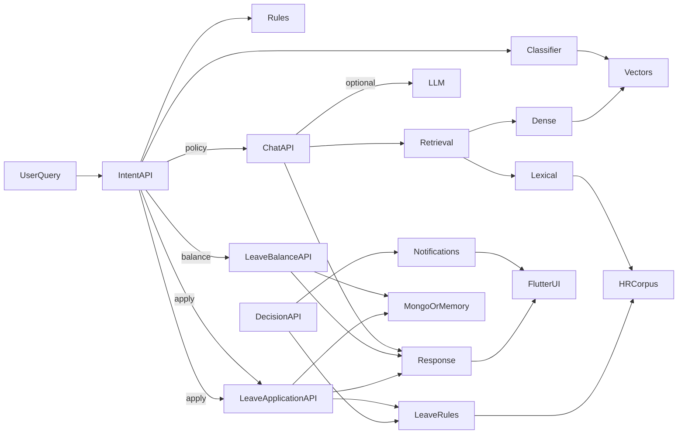

# ADAAS — Artificially Driven Assistant for Automated Solutions

A Flutter HR assistant over a Node/Express backend. Employees check leave
balances, file leave applications, and ask about company policy in plain
language. A rule-based intent router decides which of the three a message is,
then routes it to the HR APIs or to policy retrieval.

Every external dependency is optional. MongoDB is used when `MONGODB_URI` is
configured and seeded in-memory data otherwise. An LLM is used when
`LLM_PROVIDER` is set and policy answers come straight from the retrieved policy
text when it is not. The whole thing runs end to end on a laptop with no cloud
account, no API key and no billing.

## Setup

### Prerequisites

| | Version | Notes |
|---|---|---|
| Node.js | 24 | CI pins 24; anything with `node --test` and global `fetch` works |
| Flutter | stable | `flutter --version` — Dart 3.10+ for sealed-class pattern matching |
| MongoDB | optional | omit it and seeded in-memory data is used |
| Docker | optional | only for the Compose path |

### First run, from a fresh clone

```bash
git clone https://github.com/Adityansh-Chand/ADAAS.git
cd ADAAS

# Backend dependencies. REQUIRED -- see the note below.
cd hr-backend && npm ci && cd ..

# Flutter dependencies.
flutter pub get
```

> **`npm ci` is not optional.** `hr-backend/node_modules` used to be committed to
> this repository — 1,508 tracked files — and is now correctly ignored. So a fresh
> clone has no dependencies installed, and `npm test` fails with
> `Cannot find module 'cors'` until you run `npm ci`. The same applies after
> checking out any commit from before the removal, because git deletes the
> `node_modules` files it was tracking on the way past. Re-run `npm ci` and it is
> fine. `package-lock.json` is committed, so `npm ci` is reproducible.

### Verify the checkout

Four commands. All four should pass before you trust anything else.

```bash
cd hr-backend
npm test               # 60 backend tests
npm run eval           # lexical, dense and hybrid on identical splits
npm run eval:intent    # rules vs the embedding classifier
npm run embed:verify   # committed embeddings still match the corpus
cd ..
flutter analyze        # no issues
flutter test           # 33 Flutter tests
```

### Turning on dense retrieval

```bash
cd hr-backend
npm install                          # devDependencies included
RETRIEVAL_MODE=dense npm start
```

The first run downloads ~87 MB of model weights into `hr-backend/.model-cache`.
`GET /health` reports the mode actually in use, and says `degraded_because` if
dense was requested but is unavailable -- it never silently falls back without
saying so.

### Acting as a different employee

```bash
flutter run -d chrome   --dart-define=HR_API_BASE_URL=http://localhost:3000   --dart-define=HR_EMPLOYEE_ID=1002
```

Employees `1001` and `1002` are seeded with different usage, so switching is
observably real. This is a demo identity, not authentication -- see the gaps
below.

### Run it

Terminal 1:

```bash
cd hr-backend
npm start         # http://localhost:3000
```

Terminal 2 — smoke test against the running service:

```bash
cd hr-backend
npm run smoke     # 20 checks, all on response content
```

Terminal 2 — or the app:

```bash
flutter run -d chrome --dart-define=HR_API_BASE_URL=http://localhost:3000
```

### Optional configuration

Copy `hr-backend/.env.example` to `hr-backend/.env` and fill in only what you
need. Everything in it is optional; with an empty file the service runs on
seeded data with no LLM.

| Variable | Effect if unset |
|---|---|
| `MONGODB_URI` | seeded in-memory data |
| `API_KEY` | HR data and chat endpoints are unauthenticated |
| `RETRIEVAL_MODE` | `lexical` -- the weaker mode; see the table above |
| `LLM_PROVIDER` | policy answers come straight from the retrieved policy text |
| `PORT` | 3000 |
| `KB_PATH` | resolves to `assets/hr_knowledge_base.json` |

## Where this is honest, and where it is weak

The interesting numbers are the ones that show the limits, so they are stated up
front rather than left for a reader to discover.

### Policy retrieval, three methods on identical splits

Set B is 36 paraphrases of the same 26 policies, phrased the way an employee
would ask. `npm run eval` reproduces this, with every miss listed.

| Method | Set B top-1 | Set B recall@5 | Returns nothing |
|---|---|---|---|
| lexical (keyword, IDF-weighted) | 0.1111 | 0.1111 | 15 of 18 |
| **dense (MiniLM embeddings)** | **0.6111** | **0.9444** | **0 of 18** |
| hybrid (reciprocal rank fusion) | 0.6111 | 0.9444 | 0 of 18 |

Dense retrieval is the answer to the gap this project spent a long time
measuring: **5.5x the top-1 accuracy and 8.5x the recall** of keyword matching,
and it answers every paraphrase instead of failing on five in six.

Two findings worth as much as the headline:

- **Hybrid fusion does not beat dense alone.** Identical top-1 and recall@5,
  marginally worse MRR. Sweeping the fusion weights on the dev half showed equal
  weighting is *worse* than dense alone, and that every dense-favouring weight
  simply converges on dense's own score. On this corpus, fusing adds nothing --
  the same conclusion the enterprise RAG work in this portfolio reached on
  BEIR/NFCorpus.
- **Set A is not evidence for dense.** On the corpus's own `question` fields
  dense scores 1.0000, and that number is meaningless: the policy vectors embed
  that same question field, so the test is scored against its own answer key. It
  is gated only as a smoke test that the vectors load and align.

### Intent classification, two methods on four sets

`npm run eval:intent` reproduces this.

| Set | rules | embedding | What the set means |
|---|---|---|---|
| `intent_queries` | 1.0000 | 0.7292 | the rules were written with these visible |
| `held_out_1` | 0.8750 | 0.7917 | BURNED — its failures informed rule fixes |
| `held_out_2` | 0.4583 | 0.8750 | compromised — seen before a later change |
| **`held_out_3`** | **0.5667** | **0.9667** | **written before the classifier existed** |

A k-NN classifier over MiniLM embeddings of 64 labelled examples reaches **0.9667
on phrasing it has never seen**, against the rules' 0.5667. On `held_out_3` it
decides 29 of 30 itself and falls back to the rules once, when its confidence sits
below the floor.

Note the rules win on `intent_queries` — 1.0000 against 0.7292. That set was
constructed to exercise rule vocabulary, and several cases are terse or artificial
(`"leave balance"`, `"APPLY FOR LEAVE"`). It is a fair illustration of what a
fitted set measures: the rules were built to pass it, and they do.

The rules are kept rather than deleted. They are the baseline the classifier has
to beat, and they run when the classifier declines.

### How the evaluation is kept honest

- **Two sets per component**, split into dev and report halves. Every tunable was
  swept against dev only.
- **`questionWeight` is 0 in the lexical retriever on purpose.** Indexing each
  policy's `question` field measured as no help on Set B, and it would have made
  Set A meaningless for the lexical path too.
- **Gates fire in both directions.** `npm run eval:gate` fails on a floor and on
  a ceiling: lexical scoring above 0.90 on paraphrases would mean the eval
  queries had leaked into the keyword lists. Both directions are verified by
  setting an impossible threshold and confirming a non-zero exit.
- **Thresholds are chosen by measuring separation, not by maximising a score.**
  The dense cut-off sits at 0.12 because six out-of-scope queries scored at most
  0.0899 and three in-scope paraphrases at least 0.1636. Small sample, stated as
  such in `dense.js`.
- **`minScore` must stay above zero in the lexical retriever.** At zero it looked
  like an improvement -- Set B top-1 0.1111 to 0.1667, recall 0.1111 to 0.3333 --
  until the scores showed every policy at exactly 0.000 on a paraphrase, with the
  sort falling through to an alphabetical tiebreak. The gain was luck in the
  ordering of the file.
- **Committed embeddings are verified, not trusted.** `npm run embed:verify`
  re-embeds the corpus and fails if the vectors drift, if the corpus digest
  changes, or if the batch size changes -- editing one policy answer shifted four
  vectors in testing, because texts are padded to the longest item in their batch.
- **Leakage is measured, not inferred.** The intent gate first failed the build
  when held-out accuracy went above 0.95, by analogy with the retrieval ceiling.
  That was the wrong instrument — 3-way classification is far easier than
  retrieval over 26 documents, and 0.9667 was genuine. The nearest-neighbour
  similarity between every eval query and the training set settled it: max
  0.8035, mean 0.5159, nothing above 0.90. That measurement replaced the accuracy
  ceiling, because it tests the thing the ceiling was only a proxy for.
- **Held-out sets are retired once used.**
  `eval/held_out_intent_queries.json` revealed two general bugs, the fixes were
  informed by it, and it is labelled BURNED and kept only as a regression guard.
  Set 2 is the clean number. Four words that had been lifted from set 2 after
  seeing its score were removed again -- they had raised it from 0.4167 to 0.5833,
  which would have been the set scoring vocabulary copied from itself.

## Architecture


```mermaid
flowchart LR
  UserQuery --> IntentAPI
  IntentAPI --> Classifier
  IntentAPI --> Rules
  Classifier --> Vectors
  IntentAPI -->|balance| LeaveBalanceAPI
  IntentAPI -->|apply| LeaveApplicationAPI
  IntentAPI -->|policy| ChatAPI
  ChatAPI --> Retrieval
  Retrieval --> Lexical
  Retrieval --> Dense
  Lexical --> HRCorpus
  Dense --> Vectors
  ChatAPI -->|optional| LLM
  LeaveApplicationAPI --> LeaveRules
  LeaveRules --> HRCorpus
  DecisionAPI --> LeaveRules
  DecisionAPI --> Notifications
  Notifications --> FlutterUI
  IntentAPI -->|apply| LeaveApplicationAPI
  LeaveBalanceAPI --> MongoOrMemory
  LeaveApplicationAPI --> MongoOrMemory
  Response --> FlutterUI
  ChatAPI --> Response
  LeaveBalanceAPI --> Response
  LeaveApplicationAPI --> Response
```

Retrieval and intent classification both live only in the backend. The Flutter
client used to carry its own copy of each. The retriever disagreed with the server
— on "What is the remote work policy?" the backend returned the Flexible Work
Arrangement Policy and the client returned Attendance — and it ran whenever the
backend was unreachable, which is exactly when nobody was watching. The router had
the same problem in waiting, plus a worse one: the client could not run the
classifier at all, so keeping a copy there would have meant shipping the weaker
implementation whenever the network hiccuped and calling it resilience.

All three intents need the backend, so neither client-side copy bought anything.
When the service cannot be reached the app now says so.

Leave entitlements are transcribed from the corpus into `hr-backend/leave_rules.js`
and asserted against the policy text by a test, so the demo data cannot drift
away from the policies the app quotes. Balances are stored as days *used* and
remaining is derived, for the same reason.

## Backend

| Endpoint | Purpose |
|---|---|
| `GET /live` | Liveness. Unconditional: is the process up? |
| `GET /health` | Readiness. **503** when the policy corpus cannot be read. Reports the active retrieval mode. |
| `GET /metrics` | Counters, uptime, corpus size, retrieval mode. |
| `GET /leave-balance?employee_id=1001` | Entitlement, used, and remaining. |
| `POST /leave-application` | Validated against entitlement and balance; decrements it. |
| `GET /leave-applications` | Recent applications with their status. |
| `POST /leave-applications/:reference/decision` | Approve or reject. A rejection returns the days to the balance. |
| `POST /intent` | Classifies a message. Reports whether the classifier or the rules decided. |
| `GET /notifications?employee_id=1001` | Decisions the employee has not been shown. |
| `POST /notifications/:id/ack` | Mark one as seen. |
| `POST /chat` | Policy question. Cites its sources and reports which retrieval mode answered. |

Set `API_KEY` to require `X-API-Key` on the HR data and chat endpoints.

Run:

```bash
cd hr-backend
npm ci
npm test
npm start
```

With the backend running, in a second terminal:

```bash
npm run smoke
```

`npm run smoke` asserts on response content, not just status codes — that
retrieval returns the Flexible Work policy rather than Attendance, that an
over-cap leave request is refused with no reference ID, and that an accepted one
actually moves the balance.

### Optional LLM

Provider-agnostic. Leave `LLM_PROVIDER` unset and policy answers come from the
retrieved policy text.

```bash
LLM_PROVIDER=gemini     LLM_API_KEY=... LLM_MODEL=gemini-2.5-flash
LLM_PROVIDER=openai     LLM_API_KEY=... LLM_MODEL=gpt-4o-mini
LLM_PROVIDER=anthropic  LLM_API_KEY=... LLM_MODEL=claude-sonnet-5
```

`LLM_BASE_URL` points `openai` at any OpenAI-compatible endpoint. Calls are
bounded by `LLM_TIMEOUT_MS` (default 8000) via an `AbortSignal`, the key travels
in a header rather than the URL, and any provider failure falls back to the
retrieved policy text with the reason reported in `llm_status`. A legacy
`GEMINI_API_KEY` is still honoured and logs a note at startup.

### Docker and Kubernetes

```bash
cd hr-backend
cp .env.example .env
docker compose up --build
```

`KB_PATH` is set explicitly in the Dockerfile rather than left to resolve
relative to `WORKDIR`. Kubernetes manifests are in `hr-backend/k8s/deployment.yaml`;
readiness probes `/health` so a pod that cannot read the corpus leaves rotation,
and liveness probes `/live` so a bad asset mount does not restart-loop it. For
multi-replica deployments configure `MONGODB_URI`, or applications submitted to
one pod are invisible to the others.

CI builds the image, starts it, and asserts the running container can answer a
policy question — the build succeeding is not evidence the corpus is readable
inside it.

## Flutter App

```bash
flutter pub get
flutter analyze
flutter test
flutter run -d chrome \
  --dart-define=HR_API_BASE_URL=http://localhost:3000 \
  --dart-define=HR_API_KEY=change-me
```

Every HTTP call is bounded — connect, receive and send timeouts are set in
`lib/services/http_client.dart`, and there is no code path that builds a client
without them. Dio's defaults are null, meaning wait forever.

A failed request is never presented as a success. `applyForLeave` returns a
sealed result with no constructor that produces a reference ID without a server,
and failures render in a distinct bubble labelled `NOT COMPLETED`. The previous
build answered every failure — unreachable host, timeout, 401, 500 — with a
locally generated *"Success! Your request for **Casual Leave** has been submitted
for approval. Reference ID: LMS-123456"* while nothing was persisted anywhere.

## Tests

**93 total: 60 backend, 33 Flutter.** `flutter analyze` clean.

The ones worth knowing about:

- An unreachable, stalled, 401-ing, 422-ing and 500-ing backend each produce a
  failure or rejection, never a submitted result. Verified against a real
  `HttpServer`, not a mock.
- Dense retrieval answers a paraphrase the lexical retriever returns nothing for,
  and the test asserts the lexical failure too, so the comparison is real rather
  than asserted.
- Dense retrieval refuses an out-of-scope query, so the threshold is exercised
  rather than assumed.
- Rejecting a leave application returns the days to the balance; approving does
  not; deciding twice is refused and does not restore twice.
- An employee cannot decide their own application.
- A balance never exceeds its entitlement, even after a restore.
- Entitlements match the policy text they were transcribed from.
- A stalled LLM provider does not stall the caller -- the test measures the
  deadline rather than trusting the constant.
- Retrieval matching is word-bounded: the corpus keyword `cl` no longer fires
  inside `clients`, and the `IT` category no longer scores on the letters "it"
  inside `entitled` and `submit`.
- The precomputed vectors cover every policy and have the expected dimensions,
  so a policy added without re-embedding fails on the next run.
- The embedding classifier beats the rules on held-out phrasing, asserted in both
  directions so a regression either way is caught.
- The classifier declines rather than guessing when nothing in training is close.
- No held-out intent query is a paraphrase of a training example.
- A decision notifies the applicant and not the approver; a refused application
  notifies nobody, because nothing happened.

## Reviewer Status

- **Purpose:** Flutter HR assistant with a Node backend for leave workflows and
  policy retrieval.
- **Quickstart:** `cd hr-backend && npm ci && npm test && npm start`, then
  `npm run smoke` and `npm run eval` in a second terminal.
- **Demo path:** `DEMO.md`.
- **What works:** eight endpoints; validated leave applications that move
  balances; an approval workflow where a rejection returns the days; policy
  retrieval in three modes with cited sources; honest failure reporting; bounded
  timeouts; readiness that can report unready; Docker/Compose/K8s config; CI
  covering tests, the retrieval quality gate, embedding verification, the smoke
  test, a container that is started and queried, and Flutter analyze/tests.
- **Known weak spots, measured:** the default retrieval mode is lexical, at
  0.1111 on paraphrases, because the better modes need a dependency whose
  transitive advisories have no upstream fix and which is therefore kept out of
  production images. With `RETRIEVAL_MODE=dense` the same deployment reaches
  0.6111 retrieval and 0.9667 intent classification. Notifications are a table
  this service owns, not email or push.
- **Remaining gaps:** no identity provider — `HR_EMPLOYEE_ID` selects a seeded
  demo employee and proves nothing about who the user is; notifications are
  in-process and lost on restart when Mongo is not configured; no email or push
  delivery; production HR data integration, managed MongoDB, managed secrets,
  cloud deployment, and policy data governance.
- **Security posture:** `npm audit --omit=dev` reports zero vulnerabilities. Four
  high-severity advisories remain in devDependencies only (adm-zip and sharp, via
  onnxruntime-node, via the embeddings package) and have no fix available
  upstream; the Dockerfile installs with `--omit=dev` so none of it ships.
- **Portfolio index:** https://github.com/Adityansh-Chand/ai-engineering-portfolio

## License

MIT
