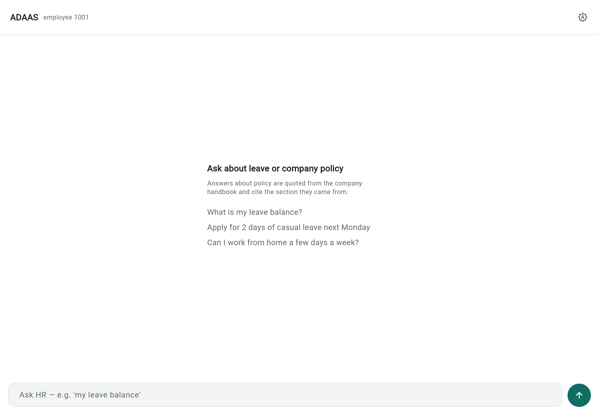
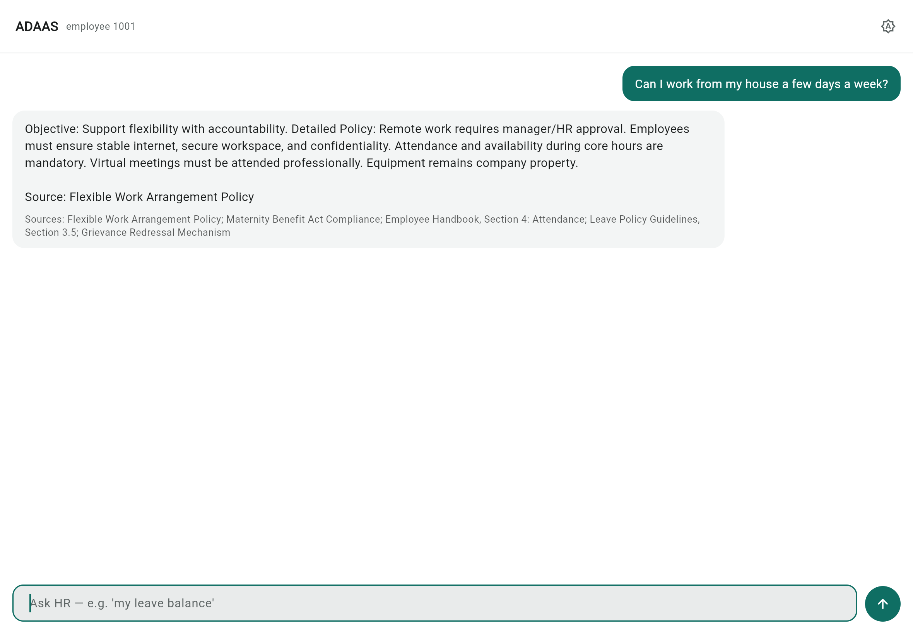
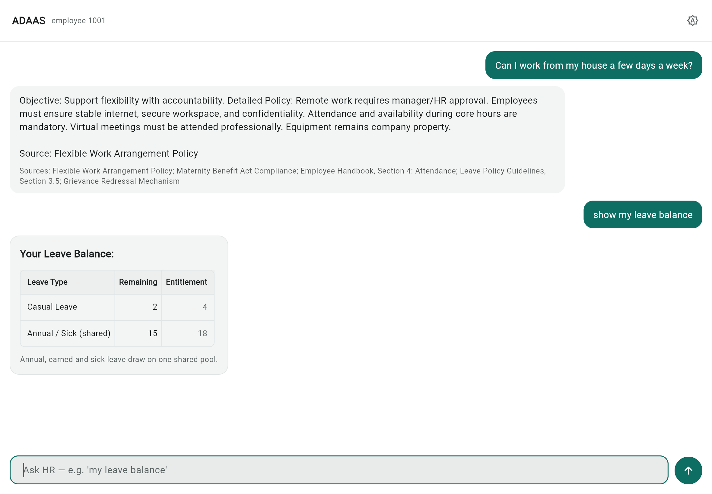
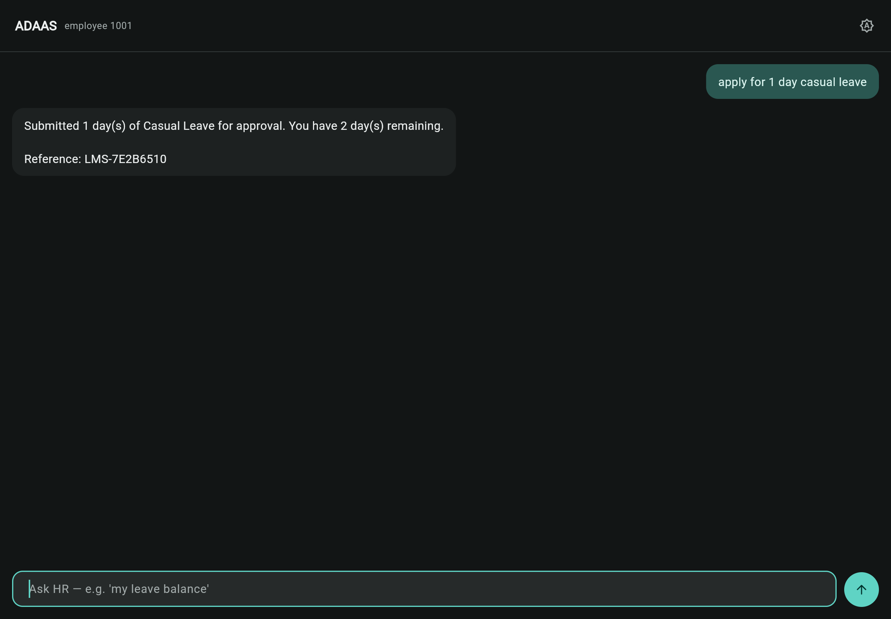
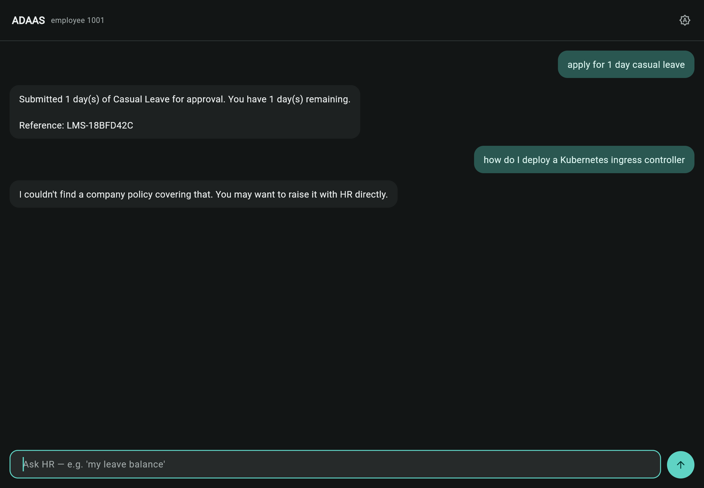
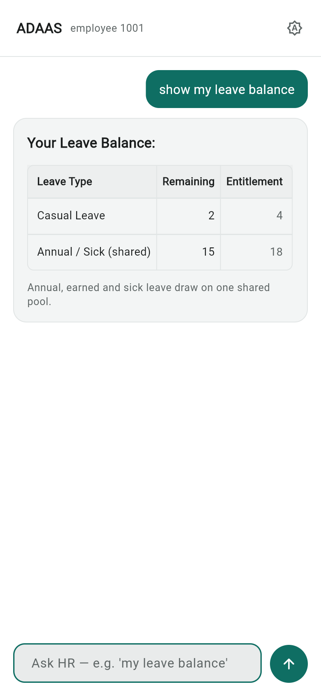
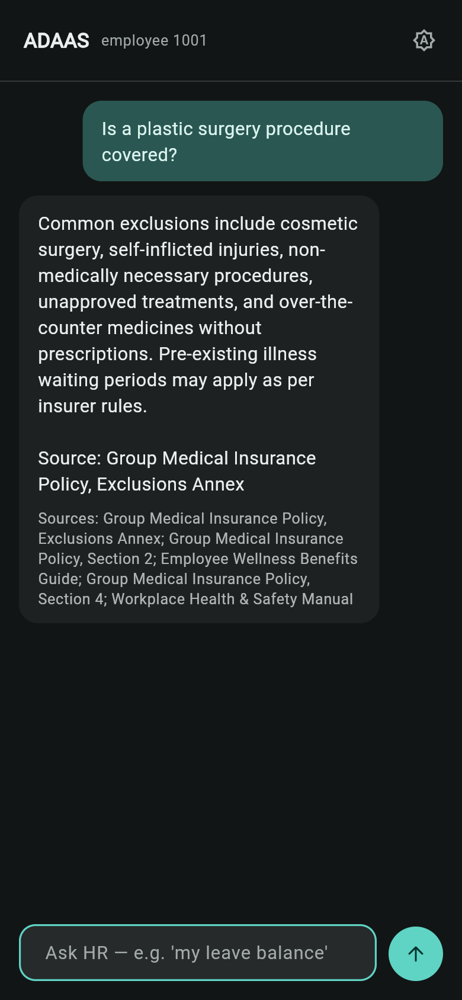
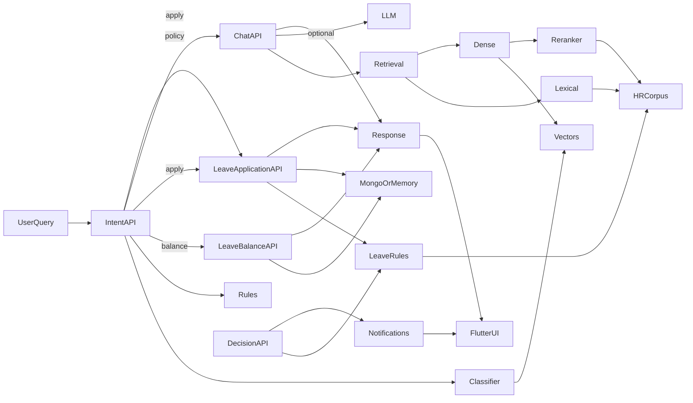

# ADAAS — Artificially Driven Assistant for Automated Solutions

A Flutter HR assistant over a Node/Express backend. Employees check leave
balances, file leave applications, and ask about company policy in plain
language. A multinomial logistic-regression classifier over sentence embeddings
decides which of the three a message is, with the original rule-based router kept
as its fallback and its baseline, then routes it to the HR APIs or to policy
retrieval.

Every external dependency is optional. MongoDB is used when `MONGODB_URI` is
configured and seeded in-memory data otherwise. An LLM is used when
`LLM_PROVIDER` is set and policy answers come straight from the retrieved policy
text when it is not. The whole thing runs end to end on a laptop with no cloud
account, no API key and no billing.

## What it looks like

Regenerate with `node tool/capture_screenshots.js`, which drives the real app in
headless Chrome against the running backend. Nothing here is a mock-up: the
policy text is what retrieval returned, the balance figures are what the API
returned, and the reference id was minted by the request that produced it.

| | |
|---|---|
|  |  |
| **First run.** Follows the system theme; the toggle cycles system, light, dark. | **A policy question**, answered from the retrieved policy with the source named. |
|  |  |
| **Leave balance**, live from the API. 4 and 18 are the entitlements a test asserts against the policy text. | **A filed application**, dark theme, with the reference id the backend issued. |
|  |  |
| **Refusing to answer.** No company policy covers Kubernetes, and it says so rather than returning its closest guess. | **390x844.** The table keeps its column alignment at mobile width. |
|  | |
| **The same width in dark**, answering a question about what the medical plan excludes. | `node tool/check_screenshots.js` verifies every image is present, valid and referenced. It cannot verify they still match the app — that is a manual rerun, and the note in the script says why. |

> These screenshots earned their place before they were ever committed. The first
> capture run asked *"Can I work from my house a few days a week?"* and the app
> filed a five-day casual leave application. See
> [Intent classification](#intent-classification-two-methods-on-five-sets) — no
> evaluation had ever caught it, and there is now a gate that does.

## Setup

### Prerequisites

| | Version | Notes |
|---|---|---|
| Node.js | 24 | CI pins 24; anything with `node --test` and global `fetch` works |
| Flutter | stable | `flutter --version` — Dart 3.10+ for sealed-class pattern matching |
| MongoDB | optional | omit it and seeded in-memory data is used |
| Docker | optional | only for the Compose path |

### First run, from a fresh clone

```bash
git clone https://github.com/Adityansh-Chand/ADAAS.git
cd ADAAS

# Backend dependencies. REQUIRED -- see the note below.
cd hr-backend && npm ci && cd ..

# Flutter dependencies.
flutter pub get
```

> **`npm ci` is not optional.** `hr-backend/node_modules` used to be committed to
> this repository — 1,508 tracked files — and is now correctly ignored. So a fresh
> clone has no dependencies installed, and `npm test` fails with
> `Cannot find module 'cors'` until you run `npm ci`. The same applies after
> checking out any commit from before the removal, because git deletes the
> `node_modules` files it was tracking on the way past. Re-run `npm ci` and it is
> fine. `package-lock.json` is committed, so `npm ci` is reproducible.

### Verify the checkout

Seven commands. All seven should pass before you trust anything else.

```bash
cd hr-backend
npm test               # 101 backend tests
npm run eval           # lexical, dense, hybrid and reranked on identical splits
npm run eval:intent    # rules vs the embedding classifier
npm run embed:verify   # committed embeddings still match the corpus
npm run rerank:verify  # committed cross-encoder logits still match the corpus
cd ..
flutter analyze        # no issues
flutter test           # 47 Flutter tests, incl. theme contrast gates
```

Only `embed:verify` and `rerank:verify` need the model weights. The two evals read
committed fixtures, so they run in seconds with no download.

### Turning on dense retrieval and reranking

```bash
cd hr-backend
npm install                          # devDependencies included
RETRIEVAL_MODE=reranked npm start
```

`RETRIEVAL_MODE` accepts `lexical` (the default), `dense`, `hybrid` or `reranked`.
`reranked` is the best-measured path; see the retrieval table below.

The first run downloads roughly 200 MB of model weights into
`hr-backend/.model-cache` — about 130 MB for the bi-encoder and 70 MB for the
cross-encoder.

`GET /health` reports the mode actually in use and says `degraded_because` when it
is not the one requested, so it never silently falls back without saying so.
`reranked` degrades to `dense` rather than to `lexical` when the model package is
absent: the corpus vectors are committed, so dense still works, but cross-encoder
scores cannot be precomputed for an arbitrary query.

### Acting as a different employee

```bash
flutter run -d chrome   --dart-define=HR_API_BASE_URL=http://localhost:3000   --dart-define=HR_EMPLOYEE_ID=1002
```

Employees `1001` and `1002` are seeded with different usage, so switching is
observably real. This is a demo identity, not authentication -- see the gaps
below.

### Run it

Terminal 1:

```bash
cd hr-backend
npm start         # http://localhost:3000
```

Terminal 2 — smoke test against the running service:

```bash
cd hr-backend
npm run smoke     # 28 checks, all on response content
```

Terminal 2 — or the app:

```bash
flutter run -d chrome --dart-define=HR_API_BASE_URL=http://localhost:3000
```

### Optional configuration

Copy `hr-backend/.env.example` to `hr-backend/.env` and fill in only what you
need. Everything in it is optional; with an empty file the service runs on
seeded data with no LLM.

| Variable | Effect if unset |
|---|---|
| `MONGODB_URI` | seeded in-memory data |
| `API_KEY` | HR data and chat endpoints are unauthenticated |
| `RETRIEVAL_MODE` | `lexical` -- the weaker mode; see the table above |
| `LLM_PROVIDER` | policy answers come straight from the retrieved policy text |
| `SESSION_SECRET` | no demo-identity authorization. With `OIDC_ISSUER` also unset, every endpoint accepts any `employee_id` and `/health` reports `authorization: none` |
| `OIDC_ISSUER` + `OIDC_AUDIENCE` | no identity verification -- the service can enforce scoping but cannot establish who the caller is |
| `OIDC_EMPLOYEE_CLAIM` | `sub` |
| `SMTP_HOST` + `NOTIFY_EMAIL_TO` | decisions are stored but not emailed |
| `<NAME>_FILE` | secrets are read from the environment. Set it to a path and the file wins -- how Docker and Kubernetes secret volumes deliver values without putting them in `docker inspect` |
| `MODEL_SERVICE_URL` | models load in-process, which needs the optional devDependency; set it to use `model-service/` instead |
| `NOTIFY_WEBHOOK_URL` | decisions are recorded and stored, but nothing is sent anywhere |
| `NOTIFICATIONS_PATH` | `hr-backend/.data/notifications.json` |
| `PORT` | 3000 |
| `KB_PATH` | resolves to `assets/hr_knowledge_base.json` |

## Where this is honest, and where it is weak

The interesting numbers are the ones that show the limits, so they are stated up
front rather than left for a reader to discover.

### Policy retrieval, four methods on identical splits

Set B is 36 paraphrases of the same 26 policies, phrased the way an employee
would ask. `npm run eval` reproduces this, with every miss listed.

| Method | Set B top-1 | Set B recall@5 | Returns nothing |
|---|---|---|---|
| lexical (keyword, IDF-weighted) | 0.1111 | 0.1111 | 15 of 18 |
| dense (bge-small-en-v1.5) | 0.7222 | 1.0000 | 0 of 18 |
| hybrid (reciprocal rank fusion) | 0.7222 | 1.0000 | 0 of 18 |
| **reranked (dense + cross-encoder)** | **0.8333** | **1.0000** | **0 of 18** |

#### The headline gain is two queries, and it does not reach significance

Added after the fact, and it corrects this section rather than decorating it.
`npm run eval` now prints 95% bootstrap intervals and paired comparisons on
identical queries:

| Method | Set B top-1 | nDCG@5 |
|---|---|---|
| lexical | 0.1111 [0.0000, 0.2778] | 0.1015 [0.0000, 0.2585] |
| dense | 0.7222 [0.5000, 0.8889] | 0.8174 [0.7110, 0.9096] |
| **reranked** | **0.8333 [0.6667, 1.0000]** | **0.8747 [0.8053, 0.9389]** |

Paired on the report half, **reranked minus dense is +0.1111 top-1 with an
interval of [-0.1667, 0.3889]** — it contains zero. On nDCG it is +0.0574
[-0.0201, 0.1474], which also contains zero. So the improvement from 0.7222 to
0.8333 is **two queries out of eighteen and is not statistically separated**.

Pooled over both halves, n=36, the nDCG difference does separate: +0.0763
[0.0285, 0.1262]. That pooling includes the dev half the reranker was chosen on,
so it is printed under a label saying exactly that. The defensible reading is
that the reranker improves the ordering measurably and the top-1 headline is
under-powered — and reranked against lexical separates comfortably either way
(+0.7222 [0.5000, 0.8889]).

This is what error bars were for. The numbers were reported correctly and read as
differences when several of them were resolution.

#### The diagnosis came from two numbers, not from trying things

The configuration this replaced scored **top-1 0.6111 against recall@5 0.9444**.
Those two numbers together say something specific: the correct policy was almost
always retrieved and then not put first. Reading the misses confirmed it — five of
seven had the gold document at rank 2 to 4, and every one of those was a confusion
*inside a near-duplicate family*. Twelve of the 26 documents belong to two such
families: five leave types under `policy_003`, seven medical sub-policies under
`policy_016`.

So the problem was ranking, not retrieval, and 22 points of top-1 were parked in
the gap between those two numbers. A bi-encoder cannot close it by getting
better — it compresses a document to one vector before it has seen the query, so
two documents on the same topic at the same granularity land near each other by
construction. Telling "casual leave, 4 days, urgent errands" from "LWP, comp-off,
emergency leave" needs a scorer that reads the query and the document together.

Two changes followed, each selected on the **dev half only** by `npm run bakeoff`,
and each worth about the same on the report half:

| Change | Set B report top-1 |
|---|---|
| baseline (all-MiniLM-L6-v2, no reranking) | 0.6111 |
| bge-small-en-v1.5 | 0.7222 |
| + mxbai-rerank-xsmall-v1 | **0.8333** |

Three misses remain, all three still a near-duplicate confusion with the gold at
rank 2 or 3: paternity vs maternity, confidentiality vs performance, and
chemotherapy vs the exclusions annex.

#### Findings worth as much as the headline

- **Five of the seven rerankers that load made it worse.** Measured on the dev
  half, all scoring the passage text production actually sends:

  | Reranker | top-1 | MRR | ONNX weights |
  |---|---|---|---|
  | **mxbai-rerank-xsmall-v1** | **0.8889** | **0.9444** | 271 MB |
  | mxbai-rerank-base-v1 | 0.8889 | 0.9352 | 704 MB |
  | *no reranking* | *0.7778* | *0.8657* | — |
  | jina-reranker-v1-tiny-en | 0.7778 | 0.8444 | 33 MB |
  | ms-marco-MiniLM-L-6-v2 | 0.7222 | 0.8426 | 86 MB |
  | ms-marco-MiniLM-L-12-v2 | 0.6667 | 0.7963 | 127 MB |
  | bge-reranker-base | 0.6111 | 0.7778 | 1.1 GB |
  | jina-reranker-v1-turbo-en | 0.5000 | 0.6824 | 148 MB |

  The two ms-marco cross-encoders are the usual default recommendation and both
  lost to doing nothing — they are trained on web-search passages, and short
  formal policy text is out of domain for them. `bge-reranker-base` was added
  specifically because it is the natural partner to a bge retriever, and it is
  the second worst thing in the table at four times the download of the winner.
  Neither of those is a result one would guess.
- **A bug in the selection stage was worth 433 MB of download.** Stage 2 of the
  bakeoff used to score candidates on *answer-only* passage text, while stage 3's
  ablation had already shown that question + answer is better and `rerank.js`
  sends question + answer in production. Measured on answer-only text
  `mxbai-rerank-base-v1` wins (MRR 0.9352 to 0.9167) and would have been
  selected, at 704 MB against 271 MB. Measured the way the service runs, the
  small model wins outright. A selection stage has to score candidates in the
  configuration they will be deployed in; this one did not, and the fix is a
  three-line change that avoided a 2.6× step up in download and resident memory
  for nothing.
- **Fusing the retriever's score back in buys exactly nothing.** Reranking
  discards the bi-encoder's opinion entirely, which was a choice nobody had
  measured. Eleven combinations were then measured — reciprocal rank fusion at
  k = 60, 10 and 1, and a min-max score blend at six weights from 0.3 to 0.9 —
  and every one of them scored *identically* to the cross-encoder alone, top-1
  0.8889 and MRR 0.9444. Both endpoints are in the table (w = 1.0 reproduces
  production, w = 0.0 reproduces no reranking) so the flatness is visibly a
  result and not a plumbing error. On this corpus the cross-encoder already knows
  everything about the ordering that the cosine knew.
- **The bigger embedding model bought nothing.** `bge-base-en-v1.5` — 768
  dimensions and roughly four times the download — tied on top-1 and scored
  marginally *worse* on MRR than `bge-small`. The small model is not a budget
  compromise here; it is what the measurement chose.
- **Reranking the whole corpus is no better than reranking the top 10.** With only
  26 documents, scoring all of them is affordable, and the ablation scored both:
  identical top-1 and MRR. The retriever was never the bottleneck.
- **Hybrid fusion still does not beat dense alone.** Same top-1 and recall@5,
  marginally worse MRR — unchanged from the previous generation, and the same
  conclusion the enterprise RAG work in this portfolio reached on BEIR/NFCorpus.
- **Set A is not evidence for anything.** On the corpus's own `question` fields
  dense scores 1.0000, and that number is meaningless: the policy vectors embed
  that same question field, so the test is scored against its own answer key. It
  is gated only as a smoke test that the vectors load and align.
- **The intent classifier got worse, and it was not reverted.** See below.

#### Refusing to answer, and the half of it that does not work

Retrieval that always returns its closest guess cannot say "no company policy
covers that". Two thresholds are applied — cosine ≥ 0.42 **and** cross-encoder
logit ≥ −2.8 — and both are needed, because they fail on different queries:
"how do I deploy a Kubernetes ingress controller" scores 0.4898 cosine, above
four genuine queries, but −3.58 on the cross-encoder; "what is the weather
forecast for tomorrow" scores −2.19 on the cross-encoder, above four genuine
queries, but only 0.4164 cosine.

Scored on `eval/out_of_scope_queries.json`, 24 probes in two tiers:

| Tier | What it is | Rejected |
|---|---|---|
| easy | plainly off-domain (Kubernetes, restaurants, gibberish) | **12 of 12** |
| hard | HR-shaped questions this corpus does not contain | **2 of 12** |

All 36 in-scope Set B queries survive both thresholds, which is gated separately —
a threshold that buys out-of-scope rejection by dropping real questions is not a
better threshold.

**The hard tier is the honest part.** Ten of those twelve leak, and the old MiniLM
configuration leaked ten of twelve too, so this is a limit of the approach rather
than a regression. "How many days of paternity leave does the law require" scores
0.78 cosine and +1.11 on the cross-encoder — higher than most genuine queries —
because the corpus *does* have a paternity leave policy. It just does not state
what the law requires. No similarity threshold can separate "the corpus is about
this topic" from "the corpus answers this question"; that distinction belongs to
the generation layer, which is why `llm.js` receives the retrieved text and is
told what it may conclude from it.

Worth recording that the previous threshold was calibrated on **6 out-of-scope
probes and 3 in-scope ones** and described as a clean gap. Re-measured on 24 and
36, the easy-tier gap holds and the hard tier was never tested. The claim was not
wrong; it was narrower than it sounded.

**A third signal was built and rejected**, so the limit is now measured rather
than asserted. `npm run probe:abstention` tests the most plausible remaining
hypothesis: a hard negative usually turns on one concept the corpus never
mentions — parking, canteen, dog, sublet, shares — whereas a genuine paraphrase
turns on concepts the corpus does have words for. A whole-sentence embedding
averages that one token away, which is exactly why the existing thresholds see
*"where can I park my car at the office"* as in-domain, so the probe scores
**words**: every content word in the corpus and in the query is embedded, and a
query is scored by its *least*-covered word.

The direction is right and the size is not. Both out-of-scope tiers score below
the in-scope median, and the words the probe picks out are the ones a reader would
name (`dog` 0.6255, `car` 0.6505, `sublet` 0.6537, `canteen` 0.6581). But the
highest threshold that keeps all 36 genuine queries is 0.6393, and it rejects
**1 of 12** hard negatives with 0.0138 of margin — a threshold sitting that close
below a real query will drop the next real query written. The declared bar was two
rejections and 0.02 of margin, both set before the numbers were seen, so nothing
shipped.

The overlap has a clean illustration. The weakest genuine query is *"how long do I
have to hand in my taxi receipts?"* at 0.6393, because the corpus says "local
transport" and never "taxi" — it scores below eight of the twelve hard negatives.
And the word `friend` is the weakest word in a hard negative (referral bonus) and
in a genuine one (telling a friend about clients) at the same score.

Three signals have now been tried on these twelve questions — document cosine,
cross-encoder logit, term coverage — and all three fail on them. What they share
is that they all measure similarity, and the distinction being asked for is not
one of similarity. Detecting "the corpus discusses this and does not answer it"
needs something that reads, which is the generation layer.

#### Graded relevance judgements, and the answer they gave

The previous version of this section said the single gold label per query was the
biggest limitation, named *"Can I tell a friend which clients we work with?"* as a
case where the retriever is marked wrong for returning a document that answers the
question, and recorded graded judgements as the next real step. That step has now
been taken, and **the result contradicts the claim it was meant to support.**

`eval/policy_qrels.json` grades all 26 documents against each of the 36 Set B
queries: **2** answers it, **1** is useful but incomplete, **0** is irrelevant.
The strict single-gold metric is untouched and still gated, so nothing written in
the qrels can move any top-1 number this project has reported. Both scorings are
printed together:

| Method | strict top-1 | nDCG@5 | top-1 relevant | top-1 answers |
|---|---|---|---|---|
| lexical | 0.1111 | 0.1015 | 0.1111 | 0.1111 |
| dense | 0.7222 | 0.8174 | 0.7778 | 0.7222 |
| hybrid | 0.7222 | 0.8140 | 0.7778 | 0.7222 |
| **reranked** | **0.8333** | **0.8747** | **0.8889** | **0.8333** |

**Of the three remaining reranked misses, zero are labelling artefacts.** Every
one is a genuine ranking error:

- *"My wife is having a baby, what am I entitled to?"* returns Maternity Leave.
  That is graded **0**, not 1 — maternity leave is an entitlement of the pregnant
  employee and the asker is not her. Sharing a family with the right answer is not
  relevance.
- *"Is chemotherapy for cancer covered by the plan?"* returns the exclusions
  annex, graded 1: it is where a reader checks whether a treatment is excluded, but
  it does not answer.
- *"Can I tell a friend which clients we work with?"* — the case the old README
  named — returns `policy_007`, **Performance Management**. The Code of Conduct
  reading was true of an earlier configuration; the current one returns something
  simply wrong. The previous section's example had gone stale, and the
  measurement is what caught it.

So the honest conclusion is the opposite of the one that was anticipated: the
strict metric was not being unfair here, and the reranker's residual errors are
real. nDCG@5 also comes in *below* the strict MRR of 0.9074 — with more relevant
documents to place well, there is more to get wrong — so the graded view is not a
softer grader wearing a different name.

Two things it did surface. `policy_001` and `policy_009` are both graded 2 for the
client-confidentiality question, and `policy_004` and `policy_008` are both graded
2 for *"what happens if I use software that is not approved?"* — one forbids the
install, the other states the consequence. Those overlaps are real properties of
the corpus and are now recorded rather than argued about.

**The weakness that remains, stated plainly:** the same person who tuned the
retriever wrote the judgements, and had seen the printed miss list for a handful
of report-half cases beforehand. Three things constrain that rather than excuse
it — the strict gates are unchanged, `npm run eval` refuses to run unless every
original gold label is graded 2 (so a gold cannot be quietly demoted to make a
ranking look better), and both metrics are printed side by side so label breadth
is visible as label breadth. Judgements written by someone with no stake in the
score would still be better, and that is now the outstanding item rather than the
graded judgements themselves.

### Intent classification, two methods on six sets

`npm run eval:intent` reproduces this.

| Set | rules | embedding | What the set means |
|---|---|---|---|
| `intent_queries` | 1.0000 | 0.9167 | the rules were written with these visible |
| `held_out_1` | 0.8750 | 0.9583 | BURNED — its failures informed rule fixes |
| `held_out_2` | 0.4583 | 1.0000 | compromised — seen before a later change |
| **`held_out_3`** | **0.5667** | **0.9667** | **written before the classifier existed** |
| **`held_out_4`** | **0.3667** | **0.8000** | **written before the classifier was rewritten** |
| **`held_out_5`** | **0.6389** | **0.9722** | **written before the action-safety fix** |

`held_out_3` is back to **0.9667** — the number it scored before the embedding
model was swapped for retrieval's benefit, and which the previous version of this
section recorded as a loss that would not be reverted. It was not reverted; it was
recovered, by replacing the classifier and then by fixing a data gap.

#### A screenshot found what six evaluation sets did not

The first run of `tool/capture_screenshots.js` asked *"Can I work from my house a
few days a week?"* and the app **filed a five-day casual leave application**.

Not a worse answer — the wrong action. `policyQuestion` answers a question;
`applyLeave` writes to a real leave balance. The failure this app was rebuilt to
prevent was fabricating a leave confirmation, and routing a policy question into
`applyLeave` arrives at the same place by a different road.

Every intent set passed, because none of them contained a policy question phrased
that way. The 36 retrieval paraphrases are policy questions by construction and no
intent fixture had ever contained one, so scoring them was free:

| | policy questions routed to an action |
|---|---|
| before | **14 of 36** |
| after | **8 of 36** (5 of them undisputed) |
| rules baseline | 3 of 36 — *the baseline is still better at this* |

The cause was distribution, not method. Of the training examples, the
`policyQuestion` class was dominated by leave-policy wording, so a first-person
sentence containing a day or a time read as a leave action whatever it asked
about. 36 examples were added covering attendance, payroll, IT, expenses,
grievance, medical, exit and conduct questions in first-person phrasing — with six
of each leave intent, so the class prior was not simply pushed toward
`policyQuestion`, which would trade one failure for two.

`eval/held_out_intent_queries_5.json` was written **before** any of that, balanced
12/12/12 for exactly that reason, and reads 0.9722. `npm run eval:intent` now gates
both: action safety on the 36, and set 5 as the converse check that safety was not
bought by refusing to act at all.

**Three things worth saying about this rather than moving on.** The rules baseline
is still better at action safety than the fitted classifier, 33 of 36 against 28 —
a fitted model beating a rule-based one on average while losing on the axis that
carries the cost is exactly the comparison worth publishing. The probe itself is a
dev signal and not a clean number, because it was read before the fix it prompted;
set 5 is the clean measurement. And the metric is noisy: rewording **one**
training example, for a leakage-margin reason unrelated to routing, moved it from
0.8056 to 0.7778 by flipping an unrelated question about performance targets. At
n=36 one case is 2.8 points, so the gate sits two cases below the measurement and
the probe is reported as directional.

#### k-NN was the wrong classifier, and it had never been compared to anything

The previous section reported 0.9000 on `held_out_3`, down from 0.9667 before the
embedding model changed, and explained that reverting the model would burn the only
clean set the classifier had. It also said what the honest route would be: *"a
fourth held-out set written before anything is re-picked."*

That is what happened, in that order. `eval/held_out_intent_queries_4.json` was
written **first** — before the classifier was touched, before a single new training
utterance existed, and before any new score was seen. Then `npm run bakeoff:intent`
compared thirteen decision rules on the three sets that have nothing left to lose
(the training set under leave-one-out, `intent_queries`, and the burned
`held_out_1`). It **refuses to open sets 2, 3 and 4 at all** — not by convention,
by throwing. Only after the winner was committed were the held-out sets read.

| Decision rule | LOO | `intent_queries` | `held_out_1` | mean |
|---|---|---|---|---|
| **logistic regression, L2 = 1e-2** | **0.9322** | **0.8750** | **0.9167** | **0.9080** |
| nearest centroid | 0.9237 | 0.7917 | 0.9167 | 0.8774 |
| k-NN k=11, weight s⁸ | 0.8983 | 0.7292 | 0.7917 | 0.8064 |
| k-NN k=1 | 0.8983 | 0.6875 | 0.7917 | 0.7925 |
| *k-NN k=5, weight s¹ (incumbent)* | *0.8898* | *0.6458* | *0.7500* | *0.7619* |

The incumbent came **last but one of thirteen**. It was the first rule written and
it stayed, unmeasured. The reason it loses is structural rather than a matter of
tuning: k-NN decides from the distances to k points, and a contrastively-trained
encoder puts every sentence in this domain into a narrow high cosine band, so the
5th neighbour is nearly as loud as the 1st and a few leave-shaped phrasings in the
wrong class outvote the right one. Sharpening the vote weights to s⁸ recovers part
of it, which is the evidence for that diagnosis, but does not fix it. A linear
model uses all 384 dimensions at once and is fitted rather than looked up.

Worth noting the *nearest centroid* row — three vectors and no
hyperparameters — beats every k-NN variant by a wide margin. Whatever else is true,
the incumbent was not a strong baseline.

**Three results that do not flatter the change:**

- **The 54 new training examples did not cause the improvement.** They were written
  at the same time and are the sort of thing that gets credited for a gain. Measured
  separately, they *cost* the incumbent k-NN 0.0625 on `intent_queries`, cost the
  centroid rule 0.0417, and were roughly neutral for the winner (−0.0208 on
  `intent_queries`, +0.0417 on `held_out_1`). The gain is the classifier. The data
  was kept for input coverage, not because it scores better, and saying so is the
  difference between a measurement and a press release.
- **`held_out_3` recovered to 0.9333 at this point, not to 0.9667.** Two-thirds of
  the loss from the embedding-model swap came back and a third did not. It reached
  0.9667 only after the action-safety fix below, which was not aimed at it.
- **One case in the brand-new set 4 had to be replaced after it was scored.** The
  leakage check measured *"rules on carrying days into next year"* at 0.9135 cosine
  against an existing training example — the closest training/eval pair in the
  project and just under the 0.92 ceiling that fails the build. It was swapped for
  a distinct phrasing. This happened *after* the set had been read once, which is
  disclosed rather than glossed: the reason was a leakage measurement and not an
  accuracy one, and removing a near-paraphrase of a training example can only have
  made the set harder. Set 4 scored 0.8000 both before and after. Overall leakage
  dropped from 0.9135 to 0.8708.

Set 4 is the lowest held-out score and that is the point of it. It was written to
be harder — bare noun phrases (`"leave left?"`), a stated reason with the request
left implicit (`"moving flat next week, need the Monday"`), and policy questions
that mention a specific number of days, which is the pattern that most often drags
a policy question into `applyLeave`. It found six real failures the other sets do
not contain, including two boundary cases the fixture had flagged in advance as
deliberately ambiguous.

#### The confidence floor is a guard, not a detector

The old floor of 0.18 applied to a k-NN vote share; the new score is a softmax
probability times the query's similarity to its nearest training example. Carrying
the number across would have been arithmetic without meaning, so it was
re-measured on dev — and the measurement said the threshold cannot do the job it
looks like it does:

| | n | min | median | max |
|---|---|---|---|---|
| in-domain dev queries | 72 | 0.2324 | 0.4177 | 0.6566 |
| out-of-scope probes | 24 | 0.1661 | 0.2798 | 0.4562 |

Those ranges overlap across most of their span — two-thirds of the out-of-scope
probes score above the weakest genuine query — so this is **not** an out-of-domain
detector and is not set up as one. That matters less than it looks: routing is not
where scope is decided. A question about Kubernetes routed to `policyQuestion` then
meets retrieval's own two thresholds and is rejected there. Meanwhile declining is
genuinely expensive, because the fallback is the rules at 0.5667. The floor is set
at 0.10, below everything measured in either group, and it is documented as a guard
against degenerate input — a zero or near-orthogonal vector from a failed
embedding — rather than dressed up as a confidence gate that works.

The model is fitted by full-batch gradient descent from a zero initialisation: no
seed, no shuffling, no randomness. A test asserts that fitting twice gives
byte-identical probabilities, because the k-NN it replaced had nothing to fit and
therefore nothing to be nondeterministic about, and that property was worth not
losing quietly.

One earlier sub-finding, kept because the reasoning was wrong before the
measurement corrected it: BGE is asymmetric, trained with an instruction prefix on
the query side only, so the intent utterances were first embedded *without* it — a
k-NN vote compares two things a person might type, which is symmetric. That
argument is tidy and it is wrong. Prefixing both sides scored 0.7083 / 0.9583
against 0.6667 / 0.8750 unprefixed. Both sides being questions is what they have in
common, and the prefix puts both in the region where the model discriminates most
sharply. The vote is gone, the prefix stayed, and it is still applied to both
sides.

Note the rules still win on `intent_queries` — 1.0000 against 0.8750. That set was
constructed to exercise rule vocabulary, and several cases are terse or artificial
(`"leave balance"`, `"APPLY FOR LEAVE"`). It is a fair illustration of what a
fitted set measures: the rules were built to pass it, and they do. It is also the
classifier's weakest non-training set, which is why the bakeoff selects on it.

The rules are kept rather than deleted. They are the baseline the classifier has
to beat, and they run when the classifier declines.

### How the evaluation is kept honest

- **Two sets per component**, split into dev and report halves. Every tunable was
  swept against dev only.
- **`questionWeight` is 0 in the lexical retriever on purpose.** Indexing each
  policy's `question` field measured as no help on Set B, and it would have made
  Set A meaningless for the lexical path too.
- **Gates fire in both directions.** `npm run eval:gate` fails on a floor and on
  a ceiling: lexical scoring above 0.90 on paraphrases would mean the eval
  queries had leaked into the keyword lists. Both directions are verified by
  setting an impossible threshold and confirming a non-zero exit.
- **Thresholds are chosen by measuring separation, not by maximising a score** —
  and they do not transfer between models. The old 0.12 cosine cut-off was
  calibrated for MiniLM; bge-small's contrastive training pushes everything into a
  narrow high band, so in-scope queries now score 0.45–0.66 and 0.12 would have
  admitted gibberish. Recalibrated to 0.42 plus a cross-encoder floor, against 24
  out-of-scope probes and the Set B dev half rather than the previous 6 and 3.
- **Model choice happens in a separate script that cannot see the report half.**
  `npm run bakeoff` constructs the dev half and discards the other side, so
  selecting a bi-encoder and a reranker by score could not quietly consume the
  numbers `npm run eval` reports. Five bi-encoders, eight rerankers and eleven
  score-combination strategies were scored; the losers are in the tables above.
  `npm run bakeoff:intent` does the same for the intent decision rule and goes one
  step further — it holds a list of the three held-out set filenames and **throws**
  if asked to open one, so the discipline is enforced by the code rather than
  promised in a comment. One reranker (`gte-multilingual-reranker-base`) has no
  ONNX export transformers.js can load; that is recorded in the results as
  attempted-and-unavailable rather than silently omitted.
- **`minScore` must stay above zero in the lexical retriever.** At zero it looked
  like an improvement -- Set B top-1 0.1111 to 0.1667, recall 0.1111 to 0.3333 --
  until the scores showed every policy at exactly 0.000 on a paraphrase, with the
  sort falling through to an alphabetical tiebreak. The gain was luck in the
  ordering of the file.
- **Committed embeddings and cross-encoder logits are verified, not trusted.**
  `npm run embed:verify` re-embeds the corpus and fails if the vectors drift, if
  the corpus digest changes, or if the batch size changes. Editing one policy
  answer shifted four vectors in testing, because texts are padded to the longest
  item in their batch. `npm run rerank:verify` does the same for the 86 x 26
  committed logits — reranking cannot be replayed from the corpus alone, since the
  model has to see each query paired with each document, so those scores are
  committed the same way the vectors are and CI re-derives both.
- **The drift tolerance was wrong twice, in opposite directions.** Comparing by
  cosine reported drift on byte-identical vectors, because rounding leaves a
  vector fractionally off unit norm. Comparing float deltas against exactly
  `1e-6` then failed CI at `max component drift 1.00e-6`: ONNX accumulates around
  5e-7 differently on another CPU, so a raw value near a rounding boundary rounds
  one step either way, and `1.0000000000000002e-6 > 1e-6` is true. The check now
  compares scaled integers and allows one unit of the stored precision — real
  drift is orders of magnitude larger, as an edited policy demonstrates at 23,699
  units.
- **Leakage is measured, not inferred.** The intent gate first failed the build
  when held-out accuracy went above 0.95, by analogy with the retrieval ceiling.
  That was the wrong instrument — 3-way classification is far easier than
  retrieval over 26 documents, and 0.9667 was genuine. The nearest-neighbour
  similarity between every eval query and the training set settled it, and it is
  now the gate, because it tests the thing the ceiling was only a proxy for. It
  reads 0.8708 against a 0.92 ceiling — and it earned its keep: growing the
  training set pushed it to 0.9135, which located a case in the newly written
  held-out set 4 that was a near-paraphrase of a training example. That case was
  replaced. Without this check the set would have looked held out and not been.
- **Held-out sets are retired once used, and replaced rather than reused.**
  `eval/held_out_intent_queries.json` revealed two general bugs, the fixes were
  informed by it, and it is labelled BURNED and kept only as a regression guard.
  Four words that had been lifted from set 2 after seeing its score were removed
  again -- they had raised it from 0.4167 to 0.5833, which would have been the set
  scoring vocabulary copied from itself. Set 3 said that if intent accuracy ever
  became the priority the honest route was a fourth set written before anything was
  re-picked; when it did, set 4 was written first and the work started afterwards.
  There are now four sets, of which two are spent and two are clean, and both clean
  ones are reported whether or not they agree.
- **Relevance judgements cannot contradict the labels that predate them.**
  `eval/policy_qrels.json` grades all 26 documents per query, and `npm run eval`
  validates the fixture before scoring on it: unknown query, unknown policy id,
  grade outside {1,2}, unjudged query, or an original gold graded anything other
  than 2 all exit non-zero rather than warn. The last of those is the one that
  matters -- it is what stops a graded view from being used to quietly demote an
  inconvenient gold label -- and a test asserts it independently of the eval.

## Architecture


```mermaid
flowchart LR
  UserQuery --> IntentAPI
  IntentAPI --> Classifier
  IntentAPI --> Rules
  Classifier --> Vectors
  IntentAPI -->|balance| LeaveBalanceAPI
  IntentAPI -->|apply| LeaveApplicationAPI
  IntentAPI -->|policy| ChatAPI
  ChatAPI --> Retrieval
  Retrieval --> Lexical
  Retrieval --> Dense
  Lexical --> HRCorpus
  Dense --> Vectors
  Dense --> Reranker
  Reranker --> HRCorpus
  ChatAPI -->|optional| LLM
  LeaveApplicationAPI --> LeaveRules
  LeaveRules --> HRCorpus
  DecisionAPI --> LeaveRules
  DecisionAPI --> Notifications
  Notifications --> FlutterUI
  IntentAPI -->|apply| LeaveApplicationAPI
  LeaveBalanceAPI --> MongoOrMemory
  LeaveApplicationAPI --> MongoOrMemory
  Response --> FlutterUI
  ChatAPI --> Response
  LeaveBalanceAPI --> Response
  LeaveApplicationAPI --> Response
```

Retrieval and intent classification both live only in the backend. The Flutter
client used to carry its own copy of each. The retriever disagreed with the server
— on "What is the remote work policy?" the backend returned the Flexible Work
Arrangement Policy and the client returned Attendance — and it ran whenever the
backend was unreachable, which is exactly when nobody was watching. The router had
the same problem in waiting, plus a worse one: the client could not run the
classifier at all, so keeping a copy there would have meant shipping the weaker
implementation whenever the network hiccuped and calling it resilience.

All three intents need the backend, so neither client-side copy bought anything.
When the service cannot be reached the app now says so.

Leave entitlements are transcribed from the corpus into `hr-backend/leave_rules.js`
and asserted against the policy text by a test, so the demo data cannot drift
away from the policies the app quotes. Balances are stored as days *used* and
remaining is derived, for the same reason.

## Backend

| Endpoint | Purpose |
|---|---|
| `GET /live` | Liveness. Unconditional: is the process up? |
| `GET /health` | Readiness. **503** when the policy corpus cannot be read. Reports the active retrieval mode. |
| `GET /metrics` | Counters, uptime, corpus size, retrieval mode. |
| `GET /leave-balance?employee_id=1001` | Entitlement, used, and remaining. |
| `POST /leave-application` | Validated against entitlement and balance; decrements it. |
| `GET /leave-applications?employee_id=` | That employee's recent applications with their status. `employee_id` is required and the listing is scoped to it -- it used to return everyone's. |
| `POST /leave-applications/:reference/decision` | Approve or reject. A rejection returns the days to the balance. |
| `POST /intent` | Classifies a message. Reports whether the classifier or the rules decided. |
| `GET /notifications?employee_id=1001` | Decisions the employee has not been shown. |
| `POST /notifications/:id/ack` | Mark one as seen. |
| `POST /chat` | Policy question. Cites its sources and reports which retrieval mode answered. |

Set `API_KEY` to require `X-API-Key` on the HR data and chat endpoints.

Run:

```bash
cd hr-backend
npm ci
npm test
npm start
```

With the backend running, in a second terminal:

```bash
npm run smoke
```

`npm run smoke` asserts on response content, not just status codes — that
retrieval returns the Flexible Work policy rather than Attendance, that an
over-cap leave request is refused with no reference ID, and that an accepted one
actually moves the balance.

### Optional LLM

Provider-agnostic. Leave `LLM_PROVIDER` unset and policy answers come from the
retrieved policy text.

```bash
LLM_PROVIDER=gemini     LLM_API_KEY=... LLM_MODEL=gemini-2.5-flash
LLM_PROVIDER=openai     LLM_API_KEY=... LLM_MODEL=gpt-4o-mini
LLM_PROVIDER=anthropic  LLM_API_KEY=... LLM_MODEL=claude-sonnet-5
```

`LLM_BASE_URL` points `openai` at any OpenAI-compatible endpoint. Calls are
bounded by `LLM_TIMEOUT_MS` (default 8000) via an `AbortSignal`, the key travels
in a header rather than the URL, and any provider failure falls back to the
retrieved policy text with the reason reported in `llm_status`. A legacy
`GEMINI_API_KEY` is still honoured and logs a note at startup.

### Docker and Kubernetes

```bash
cd hr-backend
cp .env.example .env
docker compose up --build
```

`KB_PATH` is set explicitly in the Dockerfile rather than left to resolve
relative to `WORKDIR`. Kubernetes manifests are in `hr-backend/k8s/deployment.yaml`;
readiness probes `/health` so a pod that cannot read the corpus leaves rotation,
and liveness probes `/live` so a bad asset mount does not restart-loop it. For
multi-replica deployments configure `MONGODB_URI`, or applications submitted to
one pod are invisible to the others.

CI builds the image, starts it, and asserts the running container can answer a
policy question — the build succeeding is not evidence the corpus is readable
inside it.

## Flutter App

```bash
flutter pub get
flutter analyze
flutter test
flutter run -d chrome \
  --dart-define=HR_API_BASE_URL=http://localhost:3000 \
  --dart-define=HR_API_KEY=change-me
```

Every HTTP call is bounded — connect, receive and send timeouts are set in
`lib/services/http_client.dart`, and there is no code path that builds a client
without them. Dio's defaults are null, meaning wait forever.

A failed request is never presented as a success. `applyForLeave` returns a
sealed result with no constructor that produces a reference ID without a server,
and failures render in a distinct bubble labelled `NOT COMPLETED`. The previous
build answered every failure — unreachable host, timeout, 401, 500 — with a
locally generated *"Success! Your request for **Casual Leave** has been submitted
for approval. Reference ID: LMS-123456"* while nothing was persisted anywhere.

### Light and dark

The app follows the system theme and offers an in-app override cycling
system → light → dark. Colours live in `lib/theme/app_theme.dart`: a Material
`ColorScheme` per brightness, plus a `ChatColors` theme extension for the four
message grounds, which a `ColorScheme` has no slots for. The override is not
persisted across launches — that needs a storage dependency, and the cost of
losing it is one tap.

This replaced a full-bleed photograph of the Earth with a `BackdropFilter` blur
over it, which blurred harder while the keyboard was open. Three things went with
it. Contrast was accidental, because every piece of text was white on whatever
part of the image happened to be underneath. A light theme was not expressible at
all, since the colours were constants chosen against the image — three
`Colors.white`s, a 60%-alpha black and a hardcoded `0xCC5A1A16`. And it cost a
live blur over a full-screen image every frame, re-run on every keyboard metric
change, for decoration. The Lottie loader went too: 21 layers at 1000x1000 with
its colours baked into the JSON, so it could not be recoloured per theme; the
replacement draws three dots from `onSurfaceVariant` and removed the `lottie`
dependency and 138 KB of assets with it.

Contrast is now a number rather than a hope, and `flutter test` fails the build if
it drops below AA — see Tests.

## Tests

**148 total: 101 backend, 47 Flutter.** `flutter analyze` clean.

The ones worth knowing about:

- **Both themes are checked for contrast, at the WCAG AA threshold, in both
  directions.** Every message kind — answer, user, failure, notice — is measured
  against its own ground in light and dark. This found two real defects in the
  palette on its first run: the light failure badge at 3.16:1 and the light notice
  badge at 2.79:1, both since darkened. It also caught that `expect` stops at the
  first failure, which had hidden the second one. Reintroducing a white ink on the
  light failure ground fails it at 1.10:1.
- **Reranking cannot invent a result.** It reorders the shortlist retrieval
  returned and nothing else, so the service keeps the ability to say it found
  nothing; a reranker scoring all 26 documents would always have a best guess.
  Removing the logit floor fails the suite.
- **The logit floor decides whether to answer, not which sources to show.** This
  test previously asserted the opposite, and was changed deliberately rather than
  worked around: the floor used to delete sub-floor documents from ranks 2-5 as
  well, which cost recall@5 on queries that were answered anyway (0.9444 instead
  of 1.0000 on the Set B dev half). Both halves of the new contract are asserted,
  because fixing one by breaking the other would be easy -- a pool whose best
  score clears the floor keeps every candidate, and a pool whose best score does
  not returns nothing at all.
- **Fitting the classifier twice gives byte-identical probabilities.** The k-NN
  the linear model replaced had nothing to fit and so nothing to be
  nondeterministic about, and that property was worth not losing silently. If this
  fails, every accuracy figure in this README has stopped being reproducible.
- **The graded judgements cannot contradict the gold labels that predate them.**
  Every original gold must still be graded 2, every judged id must exist in the
  corpus, and every grade must be 1 or 2. This is the structural guard on
  judgements written by the same person who tuned the retriever.
- **The classifier holds up on the set written before it was rewritten.** Held-out
  set 4, at 0.8000 against the rules' 0.3667 -- the lowest of the held-out scores,
  and the only one that was created before the change it measures.
- **A policy question is never routed to a leave action.** The test that did not
  exist, and the reason a screenshot found this rather than the suite. Scored on
  the 36 retrieval paraphrases, which are policy questions by construction.
  Deliberately asymmetric: routing a request to `policyQuestion` is a worse
  answer, while routing a question to `applyLeave` writes to a leave balance. It
  asserts the converse on held-out set 5 too, so it cannot be passed by answering
  `policyQuestion` to everything -- which would score a perfect 1.0000 on the first
  half and break both leave features.
- The `reranked` mode degrades to `dense`, not to `lexical`, when the model
  package is absent, and `/health` names the reason.
- An unreachable, stalled, 401-ing, 422-ing and 500-ing backend each produce a
  failure or rejection, never a submitted result. Verified against a real
  `HttpServer`, not a mock.
- Dense retrieval answers a paraphrase the lexical retriever returns nothing for,
  and the test asserts the lexical failure too, so the comparison is real rather
  than asserted.
- Dense retrieval refuses an out-of-scope query, so the threshold is exercised
  rather than assumed.
- Rejecting a leave application returns the days to the balance; approving does
  not; deciding twice is refused and does not restore twice.
- An employee cannot decide their own application.
- A balance never exceeds its entitlement, even after a restore.
- Entitlements match the policy text they were transcribed from.
- A stalled LLM provider does not stall the caller -- the test measures the
  deadline rather than trusting the constant.
- Retrieval matching is word-bounded: the corpus keyword `cl` no longer fires
  inside `clients`, and the `IT` category no longer scores on the letters "it"
  inside `entitled` and `submit`.
- The precomputed vectors cover every policy and have the expected dimensions,
  so a policy added without re-embedding fails on the next run.
- The embedding classifier beats the rules on held-out phrasing, asserted in both
  directions so a regression either way is caught.
- The classifier declines rather than guessing when nothing in training is close.
- No held-out intent query is a paraphrase of a training example -- across all
  four sets, which is what caught the one case in set 4 that was.
- A decision notifies the applicant and not the approver; a refused application
  notifies nobody, because nothing happened.

## Platform targets

All six Flutter targets build from this checkout, and they now agree on who the
app is. They did not before: the project was scaffolded as
`artificial_intelegence` and renamed only in the places that were noticed.

| | Was | Now |
|---|---|---|
| Android `applicationId` | `com.example.adaas` | `io.github.adityanshchand.adaas` |
| Android Kotlin source path | `com/example/artificial_intelegence/` | `io/github/adityanshchand/adaas/` |
| iOS display name | `Artificial Intelegence` | `ADAAS` |
| iOS / macOS bundle id | `com.example.artificialIntelegence` | `io.github.adityanshchand.adaas` |
| Linux `APPLICATION_ID` | `com.example.adaas` | `io.github.adityanshchand.adaas` |
| Linux / Windows window title | `adaas` | `ADAAS` |
| Windows company / copyright | `com.example` | `Adityansh Chand` |
| Web title, manifest name | `adaas` | `ADAAS` |
| `pubspec` / manifest description | `A new Flutter project.` | the real one |

Three of these were more than cosmetic. The Kotlin file sat in a directory named
for the old project while declaring `package com.example.adaas`, which the
toolchain tolerates and a reader should not have to. `com.example.*` is a reserved
placeholder that both app stores reject, so no build here could ever have been
submitted. And the iOS bundle identifier was still the misspelling — the one
string a store listing is keyed on, and the hardest to change later.

The launch surfaces follow the theme too, which they also did not before. Android's
splash was `@android:color/white` in one drawable and `?android:colorBackground` in
its v21 copy — the first flashed white ahead of a dark app, the second deferred to
the platform rather than the app's own palette. Both now read one
`@color/launch_background` resource with a `values-night` override, so the two
files cannot drift. iOS launched on a hardcoded white and now uses
`systemBackgroundColor`. The web `theme_color` was `#0175C2`, the Flutter template
blue, which appears nowhere in this app; it is now the app's two surface colours
behind a `prefers-color-scheme` media query.

## What is still open

Every item that stood here has been worked. Four are closed, three produced a
measured negative result and shipped nothing, one is closed as far as anyone
inside this project can close it, and two are narrower than they were. What each
attempt cost and returned is below, because an attempt that failed is more useful
to a later reader than the goal it was aiming at.

Four of what remains is deliberately not being closed here — see
[Reserved for the capstone](#reserved-for-the-capstone). "Still open" and
"reserved" look identical in a list and mean opposite things, so they are kept
apart: one is work nobody has done, the other is work being kept because the
person who built the thing cannot honestly be the one to settle it.

### Closed

- **Error bars.** `npm run eval` and `npm run eval:intent` print 95% bootstrap
  intervals beside every score, seeded so they reproduce, plus paired comparisons
  on identical queries. This immediately corrected something this project had been
  saying: **reranked against dense is NOT statistically separated on the clean
  18-case report half** — +0.1111 top-1, interval [-0.1667, 0.3889]. Pooled over 36
  cases the nDCG difference does separate (+0.0763, [0.0285, 0.1262]), so the
  ordering gain is real; the top-1 headline is two queries and was never
  established.
- **Action safety.** An action now has to out-score answering by a margin, because
  the two mistakes do not cost the same: answering a request is recoverable, acting
  on a question writes to a leave balance. Calibrated on dev by
  `npm run bakeoff:margin`, which prints what each value costs — at margin 0.45 the
  app keeps 35 of 36 questions and files fewer than half the leave requests it is
  asked to file, which would have looked like a win against action safety alone.
  0.10 dominates: 28/36 to **31/36** questions kept, no genuine leave request lost,
  and the best dev accuracy of any value tried. `held_out_3` reached **1.0000** as
  a side effect.
- **A sixth held-out intent set.** `eval/held_out_intent_queries_6.json`, written
  before the margin existed, general rather than targeted, and deliberately
  containing four cases that mix a question with a request. It reads **0.7667**,
  the lowest of the clean sets. The leakage gate caught one case in it that
  paraphrased a training example at 0.9478 — the second time that check has caught
  a fixture written by the person who also wrote the check.
- **The model dependency is out of the API image.** `model-service/` is a separate
  package exposing `/embed` and `/rerank`; the API talks to it over HTTP when
  `MODEL_SERVICE_URL` is set. The advisory-carrying package now lives in one
  container that holds no HR data, needs no database, and can be given no egress.
  `RETRIEVAL_MODE=reranked` is deployable rather than local-only, and `/health`
  reports `model_source` so `service` and `local` are distinguishable. Verified end
  to end: a query absent from every fixture is embedded remotely and retrieved
  correctly.

### Attempted, measured, not shipped

- **A reranker that reads.** Late interaction, ColBERT-style MaxSim over token
  vectors — `npm run bakeoff -- --stage=late`. It **ties** the cross-encoder on
  top-1 (0.8889) using only the encoder already loaded, and loses on MRR (0.9352
  against 0.9444). Fusing the two changes nothing. Nothing shipped, though it is
  worth recording that a method needing no extra model matched a 271 MB one on
  top-1. What was **not** tried is a generative reranker: it needs an LLM, and
  every metric reported here is reproducible without one. That constraint is the
  reason, and it is a real limit on this item rather than an excuse.
- **Answerability.** `npm run probe:answerability` runs NLI entailment over
  (passage, "this policy states the answer to: *question*"). The direction is
  right — in-scope median 0.0266 against 0.0012 for the hard tier — and it fails
  the declared bar completely: the highest threshold that keeps all 36 genuine
  questions rejects **0 of 12**, because the weakest genuine question ("how long do
  I have to hand in my taxi receipts", which its gold policy plainly answers) sits
  below almost every hard negative.
- **Four signals have now failed on the same twelve questions**: dense cosine,
  cross-encoder logit, term coverage, NLI entailment. The hard tier stays at 2 of
  12. What remains is a reader — a generation layer saying "the policy covers
  paternity leave but does not state statutory minimums" — and reporting that would
  make the number depend on a vendor and a sampling temperature. This is the one
  open item with no path that respects the project's other constraints.

### Closed as far as it can be from inside

- **Relevance judgements from an unconflicted annotator.** `npm run annotate`
  produces a genuinely blind sheet: 294 contested pairs, with policy ids, existing
  grades, gold labels and retrieval output all withheld, rows shuffled with a fixed
  seed, and the row-to-document key written to a **separate file** the annotator
  does not receive. `--agree` reports raw agreement, Cohen's kappa, and the 2-vs-0
  disagreements that actually move a score. Exercised end to end against a
  synthetic second annotator.

  **This does not make the judgements independent, and nothing written from inside
  could.** What it removes is every other obstacle: the sheet, the blinding and the
  arithmetic all exist, so a second opinion is now an afternoon of reading. The
  item stays open until someone else does that reading.

### Narrower than it was

- **Identity — now verified, not asserted.** `hr-backend/oidc.js` verifies an ID
  token from a configured provider: RS256 over the provider's JWKS with the
  algorithm **pinned** rather than read from the token, key selection by `kid`
  with one refetch on rotation, and `iss` / `aud` / `exp` / `nbf` all checked with
  a bounded clock skew. Nine tests drive it against a local RSA key pair serving a
  real discovery document and JWKS, so the verifier runs unmodified — including
  the two classic forgeries (`alg: none`, tampered signature), a token minted for
  a different application, and an unrecognised role claim, which must **not**
  become `approver`.

  What is still missing is named rather than implied: no authorization-code flow,
  no PKCE, no refresh, and the Flutter client does not log anyone in. This closes
  "the backend cannot verify anyone" and not "the app has a login". `/health`
  reports `oidc`, `demo`, `oidc+demo` or `none`, because both paths can be on at
  once during a migration and that is a real weakening.
- **Notifications — durable, and now actually delivered.** Written through to a
  file, so a restart with no MongoDB no longer loses every decision anyone was
  told about. Two channels: the webhook, and **email over SMTP**
  (`hr-backend/smtp.js`) — EHLO, optional STARTTLS, AUTH PLAIN, one recipient,
  base64 body with an explicit charset. Hand-written rather than adding
  `nodemailer`, for the same reason the model service exists: this is the image
  that serves leave records, and the previous round was spent taking a dependency
  *out* of it.

  Two failure modes it refuses rather than papers over: **credentials are never
  sent over an unencrypted connection** (if STARTTLS is declined and `SMTP_USER`
  is set, the send fails), and body lines are dot-stuffed, without which a line
  containing a single `.` truncates the message and the remainder is read as SMTP
  commands. Both are tested against a local SMTP server speaking the real
  protocol. Still no push, and recipient resolution is a single mailbox
  (`NOTIFY_EMAIL_TO`) because this service has no directory and guessing an
  address from an employee id would silently mail the wrong person.
- **Error bars are printed; the sample is still small.** 18-query report halves, 26
  documents, and a 36-case action-safety probe that moves 2.8 points per case. The
  intervals make that legible. They do not make it go away, and a larger corpus and
  query set remains the only real fix.

### Still open, unchanged

- **The corpus now has a governance record** — `assets/hr_knowledge_base.meta.json`
  and `hr-backend/corpus.js`. Version, content digest, owner, review cadence and
  a closed category list, validated on every test run: missing fields, duplicate
  ids, unknown categories and a digest that no longer matches all fail, and a
  mutation test proves each can. `/health` reports the owner, the review age and
  whether it has lapsed.

  Two deliberate choices. The owner reads **UNASSIGNED** rather than a
  plausible-looking name — an invented owner reads as accountability while
  providing none. And the review date is **reported, not gated**: a build that
  turns red because a date passed fails on a pull request that did not touch the
  corpus, and gets disabled within a month. What no check can establish is whether
  the text is true of any real employer, and it says so on every request:
  *synthetic demonstration content*.
- **Secrets can now come from files**, not just the environment.
  `hr-backend/secrets.js` implements the `<NAME>_FILE` convention Docker and
  Kubernetes secret volumes use — file wins over variable, and an unreadable file
  **refuses** rather than falling back to a stale value, because a broken mount
  that degrades silently brings the service up healthy with the wrong credential.
  The container runs as non-root, and the Kubernetes manifest requires it at the
  platform level with a read-only root filesystem and all capabilities dropped.

  This is the consumption end only. There is **no secrets manager** — no Vault, no
  KMS, no rotation, no auditing — and no cloud deployment, managed MongoDB or
  production HR integration. Those need infrastructure this repository does not
  have, and none of them can be honestly claimed from here.
- **Nothing verifies the screenshots still match the app.**
  `node tool/check_screenshots.js` checks that they exist, are valid PNGs, are not
  blank canvases, and that the README and the capture script agree on the set. It
  cannot check that they are current: headless font rasterisation differs between
  this machine and a Linux runner, so a pixel diff would fail on every run for
  reasons unconnected to the UI. Regenerating them when the screen changes is a
  manual step, and saying so is the honest position.

## Reserved for the capstone

This project is the substrate for a Bachelor's capstone, and some of what is
still open is deliberately **not** being closed here. Recording that split
matters, because "still open" and "reserved" look identical in a list and mean
opposite things: one is work nobody has done, the other is work being kept.

The line is whether the item is a **question that can fail**. Everything reserved
below has an outcome nobody knows in advance, a way to be wrong, and a body of
published work to argue with. Everything not reserved has a known answer and only
needs doing — and reserving those would be padding a thesis with integration.

### Reserved

**1. Detecting questions the corpus cannot answer.**

The strongest of the four, and the only open item with no path that respects this
project's other constraints. Abstention rejects 12 of 12 plainly off-domain
questions and **2 of 12** HR-shaped ones the corpus does not answer, and four
signals have now failed on that same tier — dense cosine, cross-encoder logit,
term-level coverage, NLI entailment. Each was committed with the bar it would
have had to clear, declared before the numbers were seen, so the failures are
usable evidence rather than anecdote.

What makes it a research question rather than a harder try: all four measure
similarity, and "the corpus discusses this" is maximally similar to "the corpus
answers this" — *how many days of paternity leave does the law require* scores
higher than most genuine queries precisely because there is a paternity policy.
The remaining path needs something that reads, which raises the question the rest
of this repository is organised around: **how do you report a metric that depends
on a vendor, a model version and a sampling temperature?** Every number here is
currently reproducible without an API key, and that constraint is the interesting
part, not an obstacle to route around.

Connects to: SQuAD 2.0 unanswerability, BEIR, and the RAG groundedness
literature — where a system scoring well on answerable questions and hallucinating
on unanswerable ones is a known and unsolved failure mode.

**2. How much of the graded score is annotator noise.**

`npm run annotate` produces a blind sheet and `--agree` computes Cohen's kappa,
both exercised end to end. What does not exist is a second annotator, and it
cannot be produced from inside — the judgements were written by the person who
tuned the retriever, and that is the definition of the problem.

The capstone does the study, not the plumbing: recruit two or more independent
annotators, report agreement, and answer the question this repository can pose but
not settle — **is the inter-annotator disagreement larger than the differences
nDCG is being used to detect?** Given that reranked-against-dense already fails to
separate at n=18, the answer may well be yes, and a graded metric whose noise
floor exceeds its effect size is worth knowing about.

**3. Statistical power, and a corpus sized to it.**

Bootstrap intervals are printed now, so the limitation is legible: 18-query report
halves, 26 documents, and an action-safety probe where one case is 2.8 points.
Several findings in this README sit inside their own intervals.

The reserved question is the constructive one — **how many queries are needed to
detect a 5-point difference at this variance?** That is a power analysis using
machinery that already exists, and it turns "the corpus is small" from an apology
into a number that tells you what to build. Building the corpus to that size, with
graded judgements from item 2, is the natural follow-on.

**4. Generative reranking under a reproducibility constraint.**

Late interaction was tried and ties the cross-encoder on top-1 while losing on MRR
(`npm run bakeoff -- --stage=late`). A generative reranker was deliberately not
tried, and the reason is the research question: it would make every reported
number depend on a vendor. Whether a metric can be reported honestly under that
dependency — what has to be pinned, what has to be disclosed, what a reader can
still check — is a methodological question this project has an unusually strong
position to ask, having spent its whole history refusing to let numbers drift.

### Not reserved

These have known answers. Leaving them for a capstone would be reserving
integration work, which is worth neither the delay nor the chapter.

- **A real identity provider.** `/session` mints a token for any employee id.
  Putting OIDC behind it is configuration, and the authorisation it would feed —
  per-employee scoping — is already built and tested.
- **Email or push delivery.** The webhook seam exists; what is missing is a
  provider account.
- **Cloud deployment, managed MongoDB, managed secrets.** Operations.
- **Corpus governance** — an owner, a review cycle, versioning beyond git. Process,
  not research.
- **Screenshot currency.** Accepted as a manual rerun, for the reason
  `tool/check_screenshots.js` states: a pixel diff would fail on every CI run
  because headless font rasterisation differs by platform.

### The rule this section is under

An item moves from *reserved* to *open* the moment its question is answered, and
from *open* to *done* only with a number attached. Nothing is reserved because it
is hard — items 1 and 2 are reserved because they cannot be honestly settled by
the person who built the thing being measured, and 3 and 4 because the answer is
genuinely unknown.

## Reviewer Status

- **Purpose:** Flutter HR assistant with a Node backend for leave workflows and
  policy retrieval.
- **Quickstart:** `cd hr-backend && npm ci && npm test && npm start`, then
  `npm run smoke` and `npm run eval` in a second terminal.
- **Demo path:** `DEMO.md`.
- **What works:** twelve endpoints; validated leave applications that move
  balances; an approval workflow where a rejection returns the days; policy
  retrieval in four modes with cited sources; abstention on out-of-scope
  questions; per-employee authorization behind signed session tokens; durable
  notifications with an outbound webhook seam; a separate model service so the
  production image can run dense retrieval without carrying the advisory-bearing
  dependency; honest failure reporting; bounded timeouts; readiness that can
  report unready; a light/dark themed client with contrast gated in CI; seven UI
  screenshots generated from the running app; Docker/Compose/K8s config; CI
  covering tests, thirteen retrieval quality gates (two of them on graded nDCG),
  six intent gates plus a leakage ceiling, embedding and reranker verification,
  the smoke test, a container that is started and queried, and Flutter
  analyze/tests.
- **Known weak spots, measured:** retrieval reaches 0.8333 top-1 and nDCG@5
  0.8747, but **the gain over plain dense is two queries and does not reach
  significance** on the 18-case report half — the bootstrap interval on the
  difference contains zero, and that is printed rather than buried. Intent reads
  1.0000 / 0.8000 / 0.9444 / 0.7667 on the four clean held-out sets; set 6, the
  newest and most general, is the honest one at 0.7667. Five of 36 policy
  questions are still routed to a leave action, where the rule baseline misroutes
  three — the fitted model still loses to rules on the axis that carries the cost.
  Abstention rejects 12 of 12 plainly off-domain questions and 2 of 12 HR-shaped
  ones the corpus does not answer; four different signals have now failed on that
  same tier. `SESSION_SECRET` is opt-in, so a deployment that forgets it is
  unauthenticated — `/health` reports that state rather than hiding it. Abstention works on plainly
  off-domain questions (12 of 12) and mostly fails on HR-shaped questions the
  corpus does not answer (2 of 12) — now a measured limit rather than an asserted
  one, after a third signal was built, tested and rejected. Notifications are a
  table this service owns, not email or push.
- **Identity, delivery, secrets and corpus governance are now built**, and each is
  described by what it does *not* do as well as what it does: token verification
  without a login flow, email without push or a directory, file-mounted secrets
  without a secrets manager, a governance record whose owner field honestly reads
  UNASSIGNED.
- **Reserved for a capstone:** unanswerable-question detection, an
  inter-annotator agreement study, a power analysis and a corpus sized to it, and
  generative reranking under a reproducibility constraint. Each is a question that
  can fail; see [Reserved for the capstone](#reserved-for-the-capstone) for why
  those four and not the integration work.
- **Remaining gaps:** every item previously listed here has been worked, and
  [What is still open](#what-is-still-open) now records what each attempt returned
  rather than what it was aiming at. What genuinely remains: relevance judgements
  from an annotator with no stake in the score (the blind sheet and the agreement
  arithmetic exist; the second reader does not); answerability for the hard
  abstention tier, which four signals have failed at and which needs a reader
  rather than a scorer; a real identity provider behind `/session`, which mints a
  token for any employee id it is asked for; email or push behind the notification
  webhook; a corpus with an owner and a review cycle; and a larger corpus, since
  18-query halves put several reported differences inside their own error bars.
- **Security posture:** `npm audit --omit=dev` reports zero vulnerabilities. Four
  high-severity advisories remain in devDependencies only (adm-zip and sharp, via
  onnxruntime-node, via the embeddings package) and have no fix available
  upstream; the Dockerfile installs with `--omit=dev` so none of it ships.
- **Portfolio index:** https://github.com/Adityansh-Chand/ai-engineering-portfolio

## License

MIT
