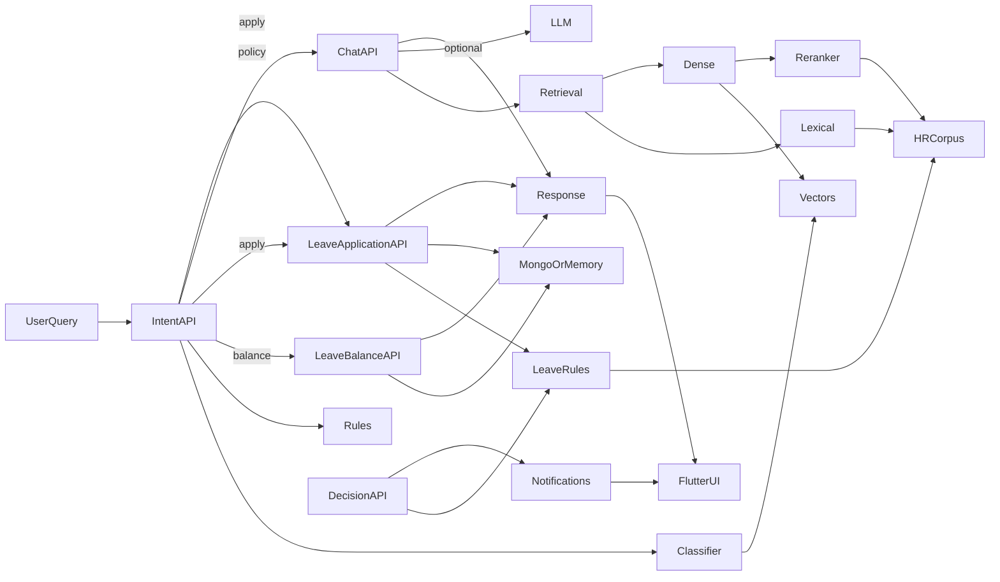

# ADAAS — Artificially Driven Assistant for Automated Solutions

A Flutter HR assistant over a Node/Express backend. Employees check leave
balances, file leave applications, and ask about company policy in plain
language. A k-NN intent classifier over sentence embeddings decides which of the
three a message is, with the original rule-based router kept as its fallback and
its baseline, then routes it to the HR APIs or to policy retrieval.

Every external dependency is optional. MongoDB is used when `MONGODB_URI` is
configured and seeded in-memory data otherwise. An LLM is used when
`LLM_PROVIDER` is set and policy answers come straight from the retrieved policy
text when it is not. The whole thing runs end to end on a laptop with no cloud
account, no API key and no billing.

## Setup

### Prerequisites

| | Version | Notes |
|---|---|---|
| Node.js | 24 | CI pins 24; anything with `node --test` and global `fetch` works |
| Flutter | stable | `flutter --version` — Dart 3.10+ for sealed-class pattern matching |
| MongoDB | optional | omit it and seeded in-memory data is used |
| Docker | optional | only for the Compose path |

### First run, from a fresh clone

```bash
git clone https://github.com/Adityansh-Chand/ADAAS.git
cd ADAAS

# Backend dependencies. REQUIRED -- see the note below.
cd hr-backend && npm ci && cd ..

# Flutter dependencies.
flutter pub get
```

> **`npm ci` is not optional.** `hr-backend/node_modules` used to be committed to
> this repository — 1,508 tracked files — and is now correctly ignored. So a fresh
> clone has no dependencies installed, and `npm test` fails with
> `Cannot find module 'cors'` until you run `npm ci`. The same applies after
> checking out any commit from before the removal, because git deletes the
> `node_modules` files it was tracking on the way past. Re-run `npm ci` and it is
> fine. `package-lock.json` is committed, so `npm ci` is reproducible.

### Verify the checkout

Seven commands. All seven should pass before you trust anything else.

```bash
cd hr-backend
npm test               # 68 backend tests
npm run eval           # lexical, dense, hybrid and reranked on identical splits
npm run eval:intent    # rules vs the embedding classifier
npm run embed:verify   # committed embeddings still match the corpus
npm run rerank:verify  # committed cross-encoder logits still match the corpus
cd ..
flutter analyze        # no issues
flutter test           # 45 Flutter tests, incl. theme contrast gates
```

Only `embed:verify` and `rerank:verify` need the model weights. The two evals read
committed fixtures, so they run in seconds with no download.

### Turning on dense retrieval and reranking

```bash
cd hr-backend
npm install                          # devDependencies included
RETRIEVAL_MODE=reranked npm start
```

`RETRIEVAL_MODE` accepts `lexical` (the default), `dense`, `hybrid` or `reranked`.
`reranked` is the best-measured path; see the retrieval table below.

The first run downloads roughly 200 MB of model weights into
`hr-backend/.model-cache` — about 130 MB for the bi-encoder and 70 MB for the
cross-encoder.

`GET /health` reports the mode actually in use and says `degraded_because` when it
is not the one requested, so it never silently falls back without saying so.
`reranked` degrades to `dense` rather than to `lexical` when the model package is
absent: the corpus vectors are committed, so dense still works, but cross-encoder
scores cannot be precomputed for an arbitrary query.

### Acting as a different employee

```bash
flutter run -d chrome   --dart-define=HR_API_BASE_URL=http://localhost:3000   --dart-define=HR_EMPLOYEE_ID=1002
```

Employees `1001` and `1002` are seeded with different usage, so switching is
observably real. This is a demo identity, not authentication -- see the gaps
below.

### Run it

Terminal 1:

```bash
cd hr-backend
npm start         # http://localhost:3000
```

Terminal 2 — smoke test against the running service:

```bash
cd hr-backend
npm run smoke     # 20 checks, all on response content
```

Terminal 2 — or the app:

```bash
flutter run -d chrome --dart-define=HR_API_BASE_URL=http://localhost:3000
```

### Optional configuration

Copy `hr-backend/.env.example` to `hr-backend/.env` and fill in only what you
need. Everything in it is optional; with an empty file the service runs on
seeded data with no LLM.

| Variable | Effect if unset |
|---|---|
| `MONGODB_URI` | seeded in-memory data |
| `API_KEY` | HR data and chat endpoints are unauthenticated |
| `RETRIEVAL_MODE` | `lexical` -- the weaker mode; see the table above |
| `LLM_PROVIDER` | policy answers come straight from the retrieved policy text |
| `PORT` | 3000 |
| `KB_PATH` | resolves to `assets/hr_knowledge_base.json` |

## Where this is honest, and where it is weak

The interesting numbers are the ones that show the limits, so they are stated up
front rather than left for a reader to discover.

### Policy retrieval, four methods on identical splits

Set B is 36 paraphrases of the same 26 policies, phrased the way an employee
would ask. `npm run eval` reproduces this, with every miss listed.

| Method | Set B top-1 | Set B recall@5 | Returns nothing |
|---|---|---|---|
| lexical (keyword, IDF-weighted) | 0.1111 | 0.1111 | 15 of 18 |
| dense (bge-small-en-v1.5) | 0.7222 | 1.0000 | 0 of 18 |
| hybrid (reciprocal rank fusion) | 0.7222 | 1.0000 | 0 of 18 |
| **reranked (dense + cross-encoder)** | **0.8333** | **1.0000** | **0 of 18** |

#### The diagnosis came from two numbers, not from trying things

The configuration this replaced scored **top-1 0.6111 against recall@5 0.9444**.
Those two numbers together say something specific: the correct policy was almost
always retrieved and then not put first. Reading the misses confirmed it — five of
seven had the gold document at rank 2 to 4, and every one of those was a confusion
*inside a near-duplicate family*. Twelve of the 26 documents belong to two such
families: five leave types under `policy_003`, seven medical sub-policies under
`policy_016`.

So the problem was ranking, not retrieval, and 22 points of top-1 were parked in
the gap between those two numbers. A bi-encoder cannot close it by getting
better — it compresses a document to one vector before it has seen the query, so
two documents on the same topic at the same granularity land near each other by
construction. Telling "casual leave, 4 days, urgent errands" from "LWP, comp-off,
emergency leave" needs a scorer that reads the query and the document together.

Two changes followed, each selected on the **dev half only** by `npm run bakeoff`,
and each worth about the same on the report half:

| Change | Set B report top-1 |
|---|---|
| baseline (all-MiniLM-L6-v2, no reranking) | 0.6111 |
| bge-small-en-v1.5 | 0.7222 |
| + mxbai-rerank-xsmall-v1 | **0.8333** |

Three misses remain, all three still a near-duplicate confusion with the gold at
rank 2 or 3: paternity vs maternity, confidentiality vs performance, and
chemotherapy vs the exclusions annex.

#### Findings worth as much as the headline

- **Three of the four rerankers made it worse.** Measured on the dev half:
  mxbai-rerank-xsmall 0.8333, no reranking 0.7778, ms-marco-MiniLM-L-6 0.7222,
  ms-marco-MiniLM-L-12 0.7222, jina-reranker-v1-tiny 0.6111. The two ms-marco
  cross-encoders are the usual default recommendation and both lost to doing
  nothing; they are trained on web-search passages, and short formal policy text
  is out of domain for them. "We measured four, three hurt, here is the one that
  did not" is a stronger claim than "we added a reranker and it helped".
- **The bigger embedding model bought nothing.** `bge-base-en-v1.5` — 768
  dimensions and roughly four times the download — tied on top-1 and scored
  marginally *worse* on MRR than `bge-small`. The small model is not a budget
  compromise here; it is what the measurement chose.
- **Reranking the whole corpus is no better than reranking the top 10.** With only
  26 documents, scoring all of them is affordable, and the ablation scored both:
  identical top-1 and MRR. The retriever was never the bottleneck.
- **Hybrid fusion still does not beat dense alone.** Same top-1 and recall@5,
  marginally worse MRR — unchanged from the previous generation, and the same
  conclusion the enterprise RAG work in this portfolio reached on BEIR/NFCorpus.
- **Set A is not evidence for anything.** On the corpus's own `question` fields
  dense scores 1.0000, and that number is meaningless: the policy vectors embed
  that same question field, so the test is scored against its own answer key. It
  is gated only as a smoke test that the vectors load and align.
- **The intent classifier got worse, and it was not reverted.** See below.

#### Refusing to answer, and the half of it that does not work

Retrieval that always returns its closest guess cannot say "no company policy
covers that". Two thresholds are applied — cosine ≥ 0.42 **and** cross-encoder
logit ≥ −2.8 — and both are needed, because they fail on different queries:
"how do I deploy a Kubernetes ingress controller" scores 0.4898 cosine, above
four genuine queries, but −3.58 on the cross-encoder; "what is the weather
forecast for tomorrow" scores −2.19 on the cross-encoder, above four genuine
queries, but only 0.4164 cosine.

Scored on `eval/out_of_scope_queries.json`, 24 probes in two tiers:

| Tier | What it is | Rejected |
|---|---|---|
| easy | plainly off-domain (Kubernetes, restaurants, gibberish) | **12 of 12** |
| hard | HR-shaped questions this corpus does not contain | **2 of 12** |

All 36 in-scope Set B queries survive both thresholds, which is gated separately —
a threshold that buys out-of-scope rejection by dropping real questions is not a
better threshold.

**The hard tier is the honest part.** Ten of those twelve leak, and the old MiniLM
configuration leaked ten of twelve too, so this is a limit of the approach rather
than a regression. "How many days of paternity leave does the law require" scores
0.78 cosine and +1.11 on the cross-encoder — higher than most genuine queries —
because the corpus *does* have a paternity leave policy. It just does not state
what the law requires. No similarity threshold can separate "the corpus is about
this topic" from "the corpus answers this question"; that distinction belongs to
the generation layer, which is why `llm.js` receives the retrieved text and is
told what it may conclude from it.

Worth recording that the previous threshold was calibrated on **6 out-of-scope
probes and 3 in-scope ones** and described as a clean gap. Re-measured on 24 and
36, the easy-tier gap holds and the hard tier was never tested. The claim was not
wrong; it was narrower than it sounded.

#### One gold label per query is a known limitation

Each Set B case names exactly one correct policy and anything else counts as a
miss. On a corpus with two near-duplicate families that is sometimes unfair.
*"Can I tell a friend which clients we work with?"* is scored against
`policy_009` (Confidentiality); `policy_001` (Code of Conduct) states that client
data must not be disclosed, which answers the question, and is counted wrong.

The labels have deliberately **not** been widened. Relaxing a metric after seeing
which cases it fails is how an evaluation stops being able to fail, and the strict
number stays comparable to every number reported earlier in this project. The
honest fix is graded relevance judgements written by someone other than the person
tuning the retriever — recorded here as the next real step rather than
approximated.

### Intent classification, two methods on four sets

`npm run eval:intent` reproduces this.

| Set | rules | embedding | What the set means |
|---|---|---|---|
| `intent_queries` | 1.0000 | 0.7083 | the rules were written with these visible |
| `held_out_1` | 0.8750 | 0.7917 | BURNED — its failures informed rule fixes |
| `held_out_2` | 0.4583 | 0.9583 | compromised — seen before a later change |
| **`held_out_3`** | **0.5667** | **0.9000** | **written before the classifier existed** |

A k-NN classifier over bge-small embeddings of 64 labelled examples reaches
**0.9000 on phrasing it has never seen**, against the rules' 0.5667.

**This number went down, and it was not reverted.** `held_out_3` scored 0.9667
with `all-MiniLM-L6-v2`. The swap to `bge-small-en-v1.5` was made for retrieval,
where it was worth four cases out of eighteen, and it cost two cases out of thirty
here. MiniLM could have been kept for intent alone — the reason it was not is
procedural, not technical: the intent model was chosen on the two sets that are
*not* held out (the fitted set and the already-compromised `held_out_2`), where
prefixed bge-small beat MiniLM on average, 0.8333 to 0.8021. Reversing that choice
on the strength of the `held_out_3` number would consume the only clean set this
classifier has, which is exactly how `held_out_1` was burned. So the trade is
recorded rather than optimised away.

One sub-finding, because the reasoning was wrong before the measurement corrected
it: BGE is asymmetric, trained with an instruction prefix on the query side only,
so the intent utterances were first embedded *without* it — a k-NN vote compares
two things a person might type, which is symmetric. That argument is tidy and it
is wrong. Prefixing both sides scored 0.7083 / 0.9583 against 0.6667 / 0.8750
unprefixed. Both sides being questions is what they have in common, and the prefix
puts both in the region where the model discriminates most sharply.

Note the rules win on `intent_queries` — 1.0000 against 0.7292. That set was
constructed to exercise rule vocabulary, and several cases are terse or artificial
(`"leave balance"`, `"APPLY FOR LEAVE"`). It is a fair illustration of what a
fitted set measures: the rules were built to pass it, and they do.

The rules are kept rather than deleted. They are the baseline the classifier has
to beat, and they run when the classifier declines.

### How the evaluation is kept honest

- **Two sets per component**, split into dev and report halves. Every tunable was
  swept against dev only.
- **`questionWeight` is 0 in the lexical retriever on purpose.** Indexing each
  policy's `question` field measured as no help on Set B, and it would have made
  Set A meaningless for the lexical path too.
- **Gates fire in both directions.** `npm run eval:gate` fails on a floor and on
  a ceiling: lexical scoring above 0.90 on paraphrases would mean the eval
  queries had leaked into the keyword lists. Both directions are verified by
  setting an impossible threshold and confirming a non-zero exit.
- **Thresholds are chosen by measuring separation, not by maximising a score** —
  and they do not transfer between models. The old 0.12 cosine cut-off was
  calibrated for MiniLM; bge-small's contrastive training pushes everything into a
  narrow high band, so in-scope queries now score 0.45–0.66 and 0.12 would have
  admitted gibberish. Recalibrated to 0.42 plus a cross-encoder floor, against 24
  out-of-scope probes and the Set B dev half rather than the previous 6 and 3.
- **Model choice happens in a separate script that cannot see the report half.**
  `npm run bakeoff` constructs the dev half and discards the other side, so
  selecting a bi-encoder and a reranker by score could not quietly consume the
  numbers `npm run eval` reports. Five bi-encoders and four rerankers were scored;
  the losers are in the tables above.
- **`minScore` must stay above zero in the lexical retriever.** At zero it looked
  like an improvement -- Set B top-1 0.1111 to 0.1667, recall 0.1111 to 0.3333 --
  until the scores showed every policy at exactly 0.000 on a paraphrase, with the
  sort falling through to an alphabetical tiebreak. The gain was luck in the
  ordering of the file.
- **Committed embeddings and cross-encoder logits are verified, not trusted.**
  `npm run embed:verify` re-embeds the corpus and fails if the vectors drift, if
  the corpus digest changes, or if the batch size changes. Editing one policy
  answer shifted four vectors in testing, because texts are padded to the longest
  item in their batch. `npm run rerank:verify` does the same for the 86 x 26
  committed logits — reranking cannot be replayed from the corpus alone, since the
  model has to see each query paired with each document, so those scores are
  committed the same way the vectors are and CI re-derives both.
- **The drift tolerance was wrong twice, in opposite directions.** Comparing by
  cosine reported drift on byte-identical vectors, because rounding leaves a
  vector fractionally off unit norm. Comparing float deltas against exactly
  `1e-6` then failed CI at `max component drift 1.00e-6`: ONNX accumulates around
  5e-7 differently on another CPU, so a raw value near a rounding boundary rounds
  one step either way, and `1.0000000000000002e-6 > 1e-6` is true. The check now
  compares scaled integers and allows one unit of the stored precision — real
  drift is orders of magnitude larger, as an edited policy demonstrates at 23,699
  units.
- **Leakage is measured, not inferred.** The intent gate first failed the build
  when held-out accuracy went above 0.95, by analogy with the retrieval ceiling.
  That was the wrong instrument — 3-way classification is far easier than
  retrieval over 26 documents, and 0.9667 was genuine. The nearest-neighbour
  similarity between every eval query and the training set settled it, and it is
  now the gate, because it tests the thing the ceiling was only a proxy for. It
  reads 0.8231 against a 0.92 ceiling on the current model.
- **Held-out sets are retired once used.**
  `eval/held_out_intent_queries.json` revealed two general bugs, the fixes were
  informed by it, and it is labelled BURNED and kept only as a regression guard.
  Set 2 is the clean number. Four words that had been lifted from set 2 after
  seeing its score were removed again -- they had raised it from 0.4167 to 0.5833,
  which would have been the set scoring vocabulary copied from itself.

## Architecture


```mermaid
flowchart LR
  UserQuery --> IntentAPI
  IntentAPI --> Classifier
  IntentAPI --> Rules
  Classifier --> Vectors
  IntentAPI -->|balance| LeaveBalanceAPI
  IntentAPI -->|apply| LeaveApplicationAPI
  IntentAPI -->|policy| ChatAPI
  ChatAPI --> Retrieval
  Retrieval --> Lexical
  Retrieval --> Dense
  Lexical --> HRCorpus
  Dense --> Vectors
  Dense --> Reranker
  Reranker --> HRCorpus
  ChatAPI -->|optional| LLM
  LeaveApplicationAPI --> LeaveRules
  LeaveRules --> HRCorpus
  DecisionAPI --> LeaveRules
  DecisionAPI --> Notifications
  Notifications --> FlutterUI
  IntentAPI -->|apply| LeaveApplicationAPI
  LeaveBalanceAPI --> MongoOrMemory
  LeaveApplicationAPI --> MongoOrMemory
  Response --> FlutterUI
  ChatAPI --> Response
  LeaveBalanceAPI --> Response
  LeaveApplicationAPI --> Response
```

Retrieval and intent classification both live only in the backend. The Flutter
client used to carry its own copy of each. The retriever disagreed with the server
— on "What is the remote work policy?" the backend returned the Flexible Work
Arrangement Policy and the client returned Attendance — and it ran whenever the
backend was unreachable, which is exactly when nobody was watching. The router had
the same problem in waiting, plus a worse one: the client could not run the
classifier at all, so keeping a copy there would have meant shipping the weaker
implementation whenever the network hiccuped and calling it resilience.

All three intents need the backend, so neither client-side copy bought anything.
When the service cannot be reached the app now says so.

Leave entitlements are transcribed from the corpus into `hr-backend/leave_rules.js`
and asserted against the policy text by a test, so the demo data cannot drift
away from the policies the app quotes. Balances are stored as days *used* and
remaining is derived, for the same reason.

## Backend

| Endpoint | Purpose |
|---|---|
| `GET /live` | Liveness. Unconditional: is the process up? |
| `GET /health` | Readiness. **503** when the policy corpus cannot be read. Reports the active retrieval mode. |
| `GET /metrics` | Counters, uptime, corpus size, retrieval mode. |
| `GET /leave-balance?employee_id=1001` | Entitlement, used, and remaining. |
| `POST /leave-application` | Validated against entitlement and balance; decrements it. |
| `GET /leave-applications` | Recent applications with their status. |
| `POST /leave-applications/:reference/decision` | Approve or reject. A rejection returns the days to the balance. |
| `POST /intent` | Classifies a message. Reports whether the classifier or the rules decided. |
| `GET /notifications?employee_id=1001` | Decisions the employee has not been shown. |
| `POST /notifications/:id/ack` | Mark one as seen. |
| `POST /chat` | Policy question. Cites its sources and reports which retrieval mode answered. |

Set `API_KEY` to require `X-API-Key` on the HR data and chat endpoints.

Run:

```bash
cd hr-backend
npm ci
npm test
npm start
```

With the backend running, in a second terminal:

```bash
npm run smoke
```

`npm run smoke` asserts on response content, not just status codes — that
retrieval returns the Flexible Work policy rather than Attendance, that an
over-cap leave request is refused with no reference ID, and that an accepted one
actually moves the balance.

### Optional LLM

Provider-agnostic. Leave `LLM_PROVIDER` unset and policy answers come from the
retrieved policy text.

```bash
LLM_PROVIDER=gemini     LLM_API_KEY=... LLM_MODEL=gemini-2.5-flash
LLM_PROVIDER=openai     LLM_API_KEY=... LLM_MODEL=gpt-4o-mini
LLM_PROVIDER=anthropic  LLM_API_KEY=... LLM_MODEL=claude-sonnet-5
```

`LLM_BASE_URL` points `openai` at any OpenAI-compatible endpoint. Calls are
bounded by `LLM_TIMEOUT_MS` (default 8000) via an `AbortSignal`, the key travels
in a header rather than the URL, and any provider failure falls back to the
retrieved policy text with the reason reported in `llm_status`. A legacy
`GEMINI_API_KEY` is still honoured and logs a note at startup.

### Docker and Kubernetes

```bash
cd hr-backend
cp .env.example .env
docker compose up --build
```

`KB_PATH` is set explicitly in the Dockerfile rather than left to resolve
relative to `WORKDIR`. Kubernetes manifests are in `hr-backend/k8s/deployment.yaml`;
readiness probes `/health` so a pod that cannot read the corpus leaves rotation,
and liveness probes `/live` so a bad asset mount does not restart-loop it. For
multi-replica deployments configure `MONGODB_URI`, or applications submitted to
one pod are invisible to the others.

CI builds the image, starts it, and asserts the running container can answer a
policy question — the build succeeding is not evidence the corpus is readable
inside it.

## Flutter App

```bash
flutter pub get
flutter analyze
flutter test
flutter run -d chrome \
  --dart-define=HR_API_BASE_URL=http://localhost:3000 \
  --dart-define=HR_API_KEY=change-me
```

Every HTTP call is bounded — connect, receive and send timeouts are set in
`lib/services/http_client.dart`, and there is no code path that builds a client
without them. Dio's defaults are null, meaning wait forever.

A failed request is never presented as a success. `applyForLeave` returns a
sealed result with no constructor that produces a reference ID without a server,
and failures render in a distinct bubble labelled `NOT COMPLETED`. The previous
build answered every failure — unreachable host, timeout, 401, 500 — with a
locally generated *"Success! Your request for **Casual Leave** has been submitted
for approval. Reference ID: LMS-123456"* while nothing was persisted anywhere.

### Light and dark

The app follows the system theme and offers an in-app override cycling
system → light → dark. Colours live in `lib/theme/app_theme.dart`: a Material
`ColorScheme` per brightness, plus a `ChatColors` theme extension for the four
message grounds, which a `ColorScheme` has no slots for. The override is not
persisted across launches — that needs a storage dependency, and the cost of
losing it is one tap.

This replaced a full-bleed photograph of the Earth with a `BackdropFilter` blur
over it, which blurred harder while the keyboard was open. Three things went with
it. Contrast was accidental, because every piece of text was white on whatever
part of the image happened to be underneath. A light theme was not expressible at
all, since the colours were constants chosen against the image — three
`Colors.white`s, a 60%-alpha black and a hardcoded `0xCC5A1A16`. And it cost a
live blur over a full-screen image every frame, re-run on every keyboard metric
change, for decoration. The Lottie loader went too: 21 layers at 1000x1000 with
its colours baked into the JSON, so it could not be recoloured per theme; the
replacement draws three dots from `onSurfaceVariant` and removed the `lottie`
dependency and 138 KB of assets with it.

Contrast is now a number rather than a hope, and `flutter test` fails the build if
it drops below AA — see Tests.

## Tests

**113 total: 68 backend, 45 Flutter.** `flutter analyze` clean.

The ones worth knowing about:

- **Both themes are checked for contrast, at the WCAG AA threshold, in both
  directions.** Every message kind — answer, user, failure, notice — is measured
  against its own ground in light and dark. This found two real defects in the
  palette on its first run: the light failure badge at 3.16:1 and the light notice
  badge at 2.79:1, both since darkened. It also caught that `expect` stops at the
  first failure, which had hidden the second one. Reintroducing a white ink on the
  light failure ground fails it at 1.10:1.
- **Reranking cannot invent a result.** It reorders the shortlist retrieval
  returned and nothing else, so the service keeps the ability to say it found
  nothing; a reranker scoring all 26 documents would always have a best guess.
  Removing the logit floor fails the suite.
- The `reranked` mode degrades to `dense`, not to `lexical`, when the model
  package is absent, and `/health` names the reason.
- An unreachable, stalled, 401-ing, 422-ing and 500-ing backend each produce a
  failure or rejection, never a submitted result. Verified against a real
  `HttpServer`, not a mock.
- Dense retrieval answers a paraphrase the lexical retriever returns nothing for,
  and the test asserts the lexical failure too, so the comparison is real rather
  than asserted.
- Dense retrieval refuses an out-of-scope query, so the threshold is exercised
  rather than assumed.
- Rejecting a leave application returns the days to the balance; approving does
  not; deciding twice is refused and does not restore twice.
- An employee cannot decide their own application.
- A balance never exceeds its entitlement, even after a restore.
- Entitlements match the policy text they were transcribed from.
- A stalled LLM provider does not stall the caller -- the test measures the
  deadline rather than trusting the constant.
- Retrieval matching is word-bounded: the corpus keyword `cl` no longer fires
  inside `clients`, and the `IT` category no longer scores on the letters "it"
  inside `entitled` and `submit`.
- The precomputed vectors cover every policy and have the expected dimensions,
  so a policy added without re-embedding fails on the next run.
- The embedding classifier beats the rules on held-out phrasing, asserted in both
  directions so a regression either way is caught.
- The classifier declines rather than guessing when nothing in training is close.
- No held-out intent query is a paraphrase of a training example.
- A decision notifies the applicant and not the approver; a refused application
  notifies nobody, because nothing happened.

## Platform targets

All six Flutter targets build from this checkout, and they now agree on who the
app is. They did not before: the project was scaffolded as
`artificial_intelegence` and renamed only in the places that were noticed.

| | Was | Now |
|---|---|---|
| Android `applicationId` | `com.example.adaas` | `io.github.adityanshchand.adaas` |
| Android Kotlin source path | `com/example/artificial_intelegence/` | `io/github/adityanshchand/adaas/` |
| iOS display name | `Artificial Intelegence` | `ADAAS` |
| iOS / macOS bundle id | `com.example.artificialIntelegence` | `io.github.adityanshchand.adaas` |
| Linux `APPLICATION_ID` | `com.example.adaas` | `io.github.adityanshchand.adaas` |
| Linux / Windows window title | `adaas` | `ADAAS` |
| Windows company / copyright | `com.example` | `Adityansh Chand` |
| Web title, manifest name | `adaas` | `ADAAS` |
| `pubspec` / manifest description | `A new Flutter project.` | the real one |

Three of these were more than cosmetic. The Kotlin file sat in a directory named
for the old project while declaring `package com.example.adaas`, which the
toolchain tolerates and a reader should not have to. `com.example.*` is a reserved
placeholder that both app stores reject, so no build here could ever have been
submitted. And the iOS bundle identifier was still the misspelling — the one
string a store listing is keyed on, and the hardest to change later.

The launch surfaces follow the theme too, which they also did not before. Android's
splash was `@android:color/white` in one drawable and `?android:colorBackground` in
its v21 copy — the first flashed white ahead of a dark app, the second deferred to
the platform rather than the app's own palette. Both now read one
`@color/launch_background` resource with a `values-night` override, so the two
files cannot drift. iOS launched on a hardcoded white and now uses
`systemBackgroundColor`. The web `theme_color` was `#0175C2`, the Flutter template
blue, which appears nowhere in this app; it is now the app's two surface colours
behind a `prefers-color-scheme` media query.

## Reviewer Status

- **Purpose:** Flutter HR assistant with a Node backend for leave workflows and
  policy retrieval.
- **Quickstart:** `cd hr-backend && npm ci && npm test && npm start`, then
  `npm run smoke` and `npm run eval` in a second terminal.
- **Demo path:** `DEMO.md`.
- **What works:** eleven endpoints; validated leave applications that move
  balances; an approval workflow where a rejection returns the days; policy
  retrieval in four modes with cited sources; abstention on out-of-scope
  questions; honest failure reporting; bounded timeouts; readiness that can report
  unready; a light/dark themed client with contrast gated in CI;
  Docker/Compose/K8s config; CI covering tests, eleven retrieval quality gates,
  embedding and reranker verification, the smoke test, a container that is started
  and queried, and Flutter analyze/tests.
- **Known weak spots, measured:** the default retrieval mode is lexical, at
  0.1111 on paraphrases, because the better modes need a dependency whose
  transitive advisories have no upstream fix and which is therefore kept out of
  production images. With `RETRIEVAL_MODE=reranked` the same deployment reaches
  0.8333 retrieval top-1 and 0.9000 intent classification. Abstention works on
  plainly off-domain questions (12 of 12) and mostly fails on HR-shaped questions
  the corpus does not answer (2 of 12) — a limit of similarity thresholds, not a
  tuning gap, and unchanged from the previous model. Every Set B query is scored
  against a single gold label, which understates the retriever on a corpus with
  two near-duplicate document families. Notifications are a table this service
  owns, not email or push.
- **Remaining gaps:** graded relevance judgements, written by someone other than
  the person tuning the retriever, are the single highest-value next step — 26
  documents and 18-query report halves mean one query moves a score by 5 points;
  no identity provider — `HR_EMPLOYEE_ID` selects a seeded demo employee and
  proves nothing about who the user is; notifications are
  in-process and lost on restart when Mongo is not configured; no email or push
  delivery; production HR data integration, managed MongoDB, managed secrets,
  cloud deployment, and policy data governance.
- **Security posture:** `npm audit --omit=dev` reports zero vulnerabilities. Four
  high-severity advisories remain in devDependencies only (adm-zip and sharp, via
  onnxruntime-node, via the embeddings package) and have no fix available
  upstream; the Dockerfile installs with `--omit=dev` so none of it ships.
- **Portfolio index:** https://github.com/Adityansh-Chand/ai-engineering-portfolio

## License

MIT
